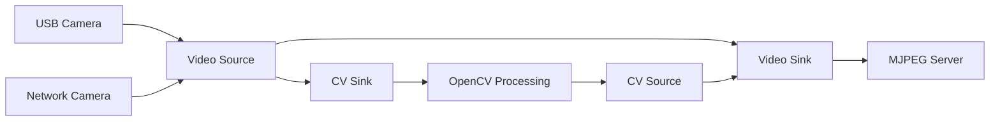

CSCore is WPILib's camera handling library, providing efficient camera capture, processing, and streaming for FRC robots and vision coprocessors.

## Overview

CSCore provides:
- USB camera capture (webcams, PS3 Eye, etc.)
- HTTP MJPEG streaming
- Network camera sources (Axis, other MJPEG streams)
- OpenCV integration for vision processing
- Multi-camera support with automatic bandwidth management
- Low-latency video streaming

## Architecture



## Core Concepts

<CardGroup cols={2}>
  <Card title="Video Sources" icon="camera" href="#video-sources">
    Camera inputs (USB, network, OpenCV)
  </Card>
  <Card title="Video Sinks" icon="upload" href="#video-sinks">
    Stream outputs (MJPEG server, OpenCV)
  </Card>
  <Card title="Video Properties" icon="sliders" href="#video-properties">
    Configure resolution, framerate, exposure
  </Card>
  <Card title="OpenCV Integration" icon="eye" href="#opencv-integration">
    Process frames with OpenCV
  </Card>
</CardGroup>

## Basic Usage

### Java API

```java
import edu.wpi.first.cameraserver.CameraServer;
import edu.wpi.first.cscore.*;

public class Robot extends TimedRobot {
  @Override
  public void robotInit() {
    // Simple camera streaming
    CameraServer.startAutomaticCapture();
    
    // Or with more control
    UsbCamera camera = CameraServer.startAutomaticCapture("Camera", 0);
    camera.setResolution(320, 240);
    camera.setFPS(30);
  }
}
```

### C++ API

```cpp
#include <cameraserver/CameraServer.h>

class Robot : public frc::TimedRobot {
 public:
  void RobotInit() override {
    // Simple camera streaming
    frc::CameraServer::StartAutomaticCapture();
    
    // Or with more control
    cs::UsbCamera camera = frc::CameraServer::StartAutomaticCapture("Camera", 0);
    camera.SetResolution(320, 240);
    camera.SetFPS(30);
  }
};
```

## Video Sources

### USB Camera

Capture from USB cameras.

```java
import edu.wpi.first.cscore.*;

// Create USB camera
UsbCamera camera = new UsbCamera("Camera", 0);  // Device 0

// Or by path
UsbCamera camera2 = new UsbCamera("Camera", "/dev/video0");

// Configure camera
camera.setResolution(640, 480);
camera.setFPS(30);
camera.setBrightness(50);  // 0-100
camera.setExposureManual(20);  // Manual exposure
// or
camera.setExposureAuto();  // Automatic exposure

// Get camera info
VideoMode mode = camera.getVideoMode();
int width = mode.width;
int height = mode.height;
VideoMode.PixelFormat format = mode.pixelFormat;
int fps = mode.fps;

// Enumerate available modes
VideoMode[] modes = camera.enumerateVideoModes();
for (VideoMode m : modes) {
    System.out.println(m.width + "x" + m.height + " @ " + m.fps);
}
```

```cpp
#include <cscore_cpp.h>

// Create USB camera
cs::UsbCamera camera{"Camera", 0};

// Configure camera
camera.SetResolution(640, 480);
camera.SetFPS(30);
camera.SetBrightness(50);
camera.SetExposureManual(20);

// Get camera info
cs::VideoMode mode = camera.GetVideoMode();
int width = mode.width;
int height = mode.height;
cs::VideoMode::PixelFormat format = mode.pixelFormat;
int fps = mode.fps;

// Enumerate modes
std::vector<cs::VideoMode> modes = camera.EnumerateVideoModes();
for (const auto& m : modes) {
  fmt::print("{}x{} @ {}\n", m.width, m.height, m.fps);
}
```

### HTTP Camera

Stream from network MJPEG cameras.

```java
// Create HTTP camera (Axis camera, IP camera, etc.)
HttpCamera axisCam = new HttpCamera(
    "Axis Camera",
    "http://10.12.34.11/mjpg/video.mjpg"
);

// Multiple URLs for failover
HttpCamera multiCam = new HttpCamera(
    "Multi Camera",
    new String[]{
        "http://10.12.34.11/mjpg/video.mjpg",
        "http://10.12.34.12/mjpg/video.mjpg"
    }
);
```

### OpenCV Source

Create video source from processed frames.

```java
// Create CV source
CvSource outputStream = CameraServer.putVideo("Processed", 640, 480);

// Put OpenCV frame
Mat processedFrame = new Mat();
outputStream.putFrame(processedFrame);
```

```cpp
// Create CV source
cs::CvSource outputStream = frc::CameraServer::PutVideo("Processed", 640, 480);

// Put OpenCV frame
cv::Mat processedFrame;
outputStream.PutFrame(processedFrame);
```

## Video Sinks

### MJPEG Server

Stream video over HTTP.

```java
import edu.wpi.first.cscore.*;

// Create MJPEG server
MjpegServer server = new MjpegServer("Server", 8080);

// Set source
server.setSource(camera);

// Access at: http://roborio-1234-frc.local:8080/stream.mjpg
```

```cpp
cs::MjpegServer server{"Server", 8080};
server.SetSource(camera);
```

### CV Sink

Capture frames for OpenCV processing.

```java
import edu.wpi.first.cscore.*;
import org.opencv.core.Mat;

// Create CV sink
CvSink cvSink = CameraServer.getVideo(camera);

// Capture frame
Mat frame = new Mat();
long frameTime = cvSink.grabFrame(frame);

if (frameTime == 0) {
    // Error occurred
    String error = cvSink.getError();
    System.err.println(error);
} else {
    // Process frame
    processFrame(frame);
}
```

```cpp
cs::CvSink cvSink = frc::CameraServer::GetVideo(camera);

cv::Mat frame;
uint64_t frameTime = cvSink.GrabFrame(frame);

if (frameTime == 0) {
  fmt::print("Error: {}\n", cvSink.GetError());
} else {
  // Process frame
  ProcessFrame(frame);
}
```

## Video Properties

### Getting Properties

```java
// Get all properties
VideoProperty[] props = camera.enumerateProperties();
for (VideoProperty prop : props) {
    System.out.println(prop.getName() + ": " + prop.get());
}

// Get specific property
VideoProperty brightness = camera.getProperty("brightness");
int value = brightness.get();
```

### Setting Properties

```java
// Common properties
camera.setBrightness(50);      // 0-100
camera.setWhiteBalanceAuto();  
camera.setWhiteBalanceManual(4000);  // Kelvin
camera.setExposureAuto();
camera.setExposureManual(20);  // Exposure time

// Generic property setting
VideoProperty prop = camera.getProperty("sharpness");
prop.set(75);
```

### Property Info

```java
VideoProperty prop = camera.getProperty("brightness");

System.out.println("Name: " + prop.getName());
System.out.println("Min: " + prop.getMin());
System.out.println("Max: " + prop.getMax());
System.out.println("Step: " + prop.getStep());
System.out.println("Default: " + prop.getDefault());
System.out.println("Current: " + prop.get());
```

## Multiple Cameras

```java
public class Robot extends TimedRobot {
  UsbCamera frontCamera;
  UsbCamera backCamera;
  VideoSource currentCamera;
  MjpegServer server;
  
  @Override
  public void robotInit() {
    // Create cameras
    frontCamera = new UsbCamera("Front", 0);
    backCamera = new UsbCamera("Back", 1);
    
    // Configure both
    frontCamera.setResolution(320, 240);
    backCamera.setResolution(320, 240);
    
    // Create server
    server = new MjpegServer("Server", 8080);
    
    // Start with front camera
    currentCamera = frontCamera;
    server.setSource(currentCamera);
  }
  
  public void switchCamera() {
    // Switch cameras
    if (currentCamera == frontCamera) {
      currentCamera = backCamera;
    } else {
      currentCamera = frontCamera;
    }
    server.setSource(currentCamera);
  }
}
```

## OpenCV Integration

### Vision Processing Thread

```java
import edu.wpi.first.cscore.*;
import edu.wpi.first.cameraserver.CameraServer;
import org.opencv.core.*;
import org.opencv.imgproc.Imgproc;

public class VisionThread extends Thread {
  @Override
  public void run() {
    // Create camera
    UsbCamera camera = CameraServer.startAutomaticCapture();
    camera.setResolution(320, 240);
    camera.setFPS(30);
    
    // Create sinks/sources
    CvSink cvSink = CameraServer.getVideo();
    CvSource outputStream = CameraServer.putVideo("Processed", 320, 240);
    
    // Processing loop
    Mat frame = new Mat();
    Mat processed = new Mat();
    
    while (!Thread.interrupted()) {
      if (cvSink.grabFrame(frame) == 0) {
        continue;
      }
      
      // Process frame
      Imgproc.cvtColor(frame, processed, Imgproc.COLOR_BGR2GRAY);
      Imgproc.threshold(processed, processed, 100, 255, Imgproc.THRESH_BINARY);
      
      // Output processed frame
      outputStream.putFrame(processed);
    }
  }
}

// Start thread in robotInit()
new VisionThread().start();
```

### C++ Vision Processing

```cpp
#include <cscore_cpp.h>
#include <opencv2/core.hpp>
#include <opencv2/imgproc.hpp>
#include <thread>

void VisionThread() {
  // Create camera
  cs::UsbCamera camera = frc::CameraServer::StartAutomaticCapture();
  camera.SetResolution(320, 240);
  camera.SetFPS(30);
  
  // Create sinks/sources
  cs::CvSink cvSink = frc::CameraServer::GetVideo();
  cs::CvSource outputStream = frc::CameraServer::PutVideo("Processed", 320, 240);
  
  // Processing loop
  cv::Mat frame;
  cv::Mat processed;
  
  while (true) {
    if (cvSink.GrabFrame(frame) == 0) {
      continue;
    }
    
    // Process frame
    cv::cvtColor(frame, processed, cv::COLOR_BGR2GRAY);
    cv::threshold(processed, processed, 100, 255, cv::THRESH_BINARY);
    
    // Output processed frame
    outputStream.PutFrame(processed);
  }
}

// Start thread in RobotInit()
std::thread visionThread(VisionThread);
visionThread.detach();
```

## Camera Server

High-level API for common camera operations.

```java
import edu.wpi.first.cameraserver.CameraServer;

// Automatic capture (simple)
CameraServer.startAutomaticCapture();

// With device number
UsbCamera camera = CameraServer.startAutomaticCapture(0);

// With name
UsbCamera camera2 = CameraServer.startAutomaticCapture("Front Camera", 0);

// Add switched camera
MjpegServer server = CameraServer.addSwitchedCamera("Switched");
server.setSource(camera1);  // Switch between cameras

// Get existing camera
VideoSource camera3 = CameraServer.getVideo("Front Camera");
```

## Low-Level C API

For direct hardware access.

```c
#include <cscore_c.h>

// Create camera
CS_Source camera = cscore::CreateUsbCameraDev("Camera", 0);

// Set properties
cscore::SetSourcePixelFormat(camera, CS_PIXFMT_MJPEG, NULL);
cscore::SetSourceResolution(camera, 640, 480, NULL);
cscore::SetSourceFPS(camera, 30, NULL);

// Create server
CS_Sink server = cscore::CreateMjpegServer("Server", "", 8080, NULL);
cscore::SetSinkSource(server, camera, NULL);
```

## Pixel Formats

| Format | Description | Use Case |
|--------|-------------|----------|
| `MJPEG` | Motion JPEG | High resolution, low CPU |
| `YUYV` | YUV 4:2:2 | OpenCV processing |
| `RGB565` | 16-bit RGB | Low bandwidth |
| `BGR` | OpenCV native | Direct OpenCV use |
| `GRAY` | Grayscale | Vision processing |

## Performance Tips

### Resolution and Framerate

```java
// Lower resolution = better performance
camera.setResolution(320, 240);  // Instead of 640x480

// Lower framerate = lower bandwidth
camera.setFPS(15);  // Instead of 30

// Use MJPEG for streaming (hardware compressed)
camera.setPixelFormat(PixelFormat.kMJPEG);
```

### Vision Processing

```java
// Reduce processing resolution
camera.setResolution(160, 120);  // Minimal for vision

// Use grayscale
camera.setPixelFormat(PixelFormat.kGray);

// Process every Nth frame
int frameCount = 0;
if (frameCount++ % 3 == 0) {
    processFrame(frame);
}
```

## Common Cameras

### Microsoft LifeCam HD-3000

```java
UsbCamera camera = CameraServer.startAutomaticCapture();
camera.setResolution(320, 240);
camera.setFPS(30);
camera.setExposureManual(50);
```

### PS3 Eye

```java
UsbCamera camera = CameraServer.startAutomaticCapture();
camera.setResolution(320, 240);
camera.setFPS(60);  // Supports 60 FPS
```

### Limelight

```java
// Limelight is accessed via NetworkTables, not CSCore
NetworkTable table = NetworkTableInstance.getDefault().getTable("limelight");
double tx = table.getEntry("tx").getDouble(0.0);
```

## Source Code

View the full source code on GitHub:
- [CSCore Java](https://github.com/wpilibsuite/allwpilib/tree/main/cscore/src/main/java/edu/wpi/first/cscore)
- [CSCore C++](https://github.com/wpilibsuite/allwpilib/tree/main/cscore/src/main/native/include)
- [CSCore Implementation](https://github.com/wpilibsuite/allwpilib/tree/main/cscore/src/main/native/cpp)

## Related Documentation

<CardGroup cols={2}>
  <Card title="CameraServer" icon="video" href="/api/cameraserver/overview">
    High-level camera API
  </Card>
  <Card title="WPINet" icon="network-wired" href="/api/wpinet/overview">
    Network streaming backend
  </Card>
  <Card title="OpenCV" icon="eye" href="https://docs.opencv.org">
    Vision processing library
  </Card>
</CardGroup>
