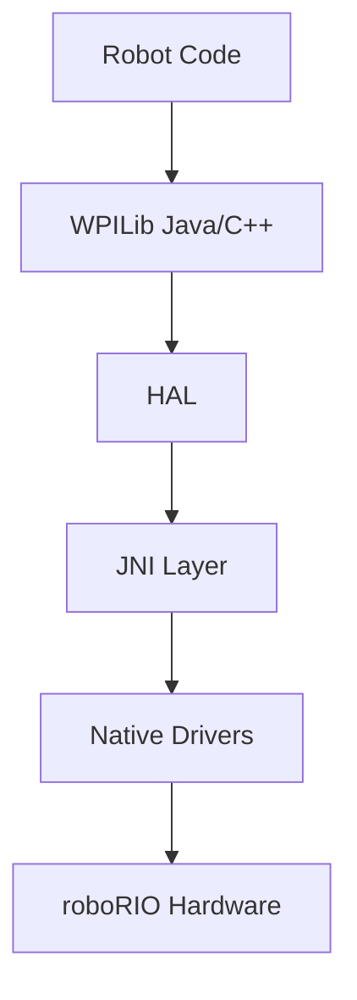

The Hardware Abstraction Layer (HAL) provides low-level access to the roboRIO hardware and FRC control system. It serves as the foundation for WPILib's higher-level APIs.

## Overview

The HAL is a C-based API that provides direct hardware access while abstracting platform-specific details. Most users should use WPILib's higher-level APIs instead of calling HAL directly.

<Note>
  The HAL is primarily used internally by WPILib. Direct HAL usage is only recommended for advanced users implementing custom hardware interfaces or debugging low-level issues.
</Note>

## Architecture



## Core Modules

<CardGroup cols={2}>
  <Card title="HAL Main" icon="microchip" href="#hal-initialization">
    Core initialization and system control
  </Card>
  <Card title="Digital I/O" icon="plug" href="#digital-io">
    Digital input/output operations
  </Card>
  <Card title="Analog I/O" icon="wave-square" href="#analog-io">
    Analog input/output operations
  </Card>
  <Card title="PWM" icon="signal" href="#pwm">
    Pulse width modulation control
  </Card>
  <Card title="CAN" icon="network-wired" href="#can">
    CAN bus communication
  </Card>
  <Card title="Driver Station" icon="gamepad" href="#driver-station">
    FMS and driver station interface
  </Card>
</CardGroup>

## HAL Initialization

```c
#include <hal/HAL.h>

// Initialize HAL - must be called before any other HAL functions
int32_t status = 0;
HAL_Bool success = HAL_Initialize(500, 0);

if (!success) {
  // Handle initialization failure
}

// Get system status
int32_t fpgaVersion = HAL_GetFPGAVersion(&status);
int64_t fpgaTime = HAL_GetFPGATime(&status);

// Observe user program starting
HAL_ObserveUserProgramStarting();

// Shutdown HAL when done
HAL_Shutdown();
```

## Digital I/O

### Headers

- `hal/DIO.h` - Digital I/O control
- `hal/Counter.h` - Counter operations
- `hal/Encoder.h` - Encoder operations
- `hal/DutyCycle.h` - Duty cycle measurement

### Digital Port Operations

```c
#include <hal/DIO.h>

int32_t status = 0;

// Initialize digital port
HAL_DigitalHandle dioHandle = HAL_InitializeDIOPort(
    HAL_GetPort(0),  // Port 0
    HAL_Bool input,  // true for input, false for output
    NULL,            // Allocation location (optional)
    &status);

// Read input
HAL_Bool value = HAL_GetDIO(dioHandle, &status);

// Write output
HAL_SetDIO(dioHandle, HAL_TRUE, &status);

// Cleanup
HAL_FreeDIOPort(dioHandle);
```

### Encoder Operations

```c
#include <hal/Encoder.h>

int32_t status = 0;

// Initialize encoder
HAL_EncoderHandle encoder = HAL_InitializeEncoder(
    HAL_GetPort(0),      // Channel A
    HAL_AnalogTriggerType_kInWindow,
    HAL_GetPort(1),      // Channel B
    HAL_AnalogTriggerType_kInWindow,
    HAL_FALSE,           // Reverse direction
    HAL_EncodingType_k4X, // Encoding type
    &status);

// Get encoder count
int32_t count = HAL_GetEncoder(encoder, &status);

// Get encoder rate
double rate = HAL_GetEncoderRate(encoder, &status);

// Reset encoder
HAL_ResetEncoder(encoder, &status);

// Cleanup
HAL_FreeEncoder(encoder, &status);
```

## Analog I/O

### Headers

- `hal/AnalogInput.h` - Analog input
- `hal/AnalogOutput.h` - Analog output
- `hal/AnalogAccumulator.h` - Analog accumulator
- `hal/AnalogTrigger.h` - Analog trigger
- `hal/AnalogGyro.h` - Analog gyroscope

### Analog Input

```c
#include <hal/AnalogInput.h>

int32_t status = 0;

// Initialize analog input
HAL_AnalogInputHandle analogInput = HAL_InitializeAnalogInputPort(
    HAL_GetPort(0),
    NULL,
    &status);

// Read voltage (0-5V)
int32_t rawValue = HAL_GetAnalogValue(analogInput, &status);
double voltage = HAL_GetAnalogVoltage(analogInput, &status);

// Configure averaging
HAL_SetAnalogAverageBits(analogInput, 4, &status);

// Cleanup
HAL_FreeAnalogInputPort(analogInput);
```

## PWM

### Headers

- `hal/PWM.h` - PWM control

### PWM Operations

```c
#include <hal/PWM.h>

int32_t status = 0;

// Initialize PWM
HAL_DigitalHandle pwmHandle = HAL_InitializePWMPort(
    HAL_GetPort(0),
    NULL,
    &status);

// Set PWM speed (-1.0 to 1.0)
HAL_SetPWMSpeed(pwmHandle, 0.5, &status);

// Or set raw PWM value
HAL_SetPWMRaw(pwmHandle, 1500, &status)  // microseconds

// Configure PWM parameters
HAL_SetPWMPeriodScale(pwmHandle, 0, &status);  // 0 = 5.05ms period

// Cleanup
HAL_FreePWMPort(pwmHandle, &status);
```

## CAN

### Headers

- `hal/CAN.h` - CAN bus communication
- `hal/CANAPI.h` - CAN API types
- `hal/CANAPITypes.h` - CAN data structures

### CAN Communication

```c
#include <hal/CAN.h>
#include <hal/CANAPI.h>

int32_t status = 0;

// Send CAN message
uint8_t data[8] = {0x01, 0x02, 0x03, 0x04, 0x05, 0x06, 0x07, 0x08};
HAL_CAN_SendMessage(
    0x12345678,  // Message ID
    data,        // Data buffer
    8,           // Data size
    HAL_CAN_SEND_PERIOD_NO_REPEAT,
    &status);

// Receive CAN message
uint8_t receiveData[8];
uint8_t dataSize;
uint32_t messageID;
uint64_t timestamp;
HAL_CAN_ReceiveMessage(
    &messageID,
    0x1FFFFFFF,  // Message ID mask
    receiveData,
    &dataSize,
    &timestamp,
    &status);
```

## Driver Station

### Headers

- `hal/DriverStation.h` - Driver station interface
- `hal/DriverStationTypes.h` - Driver station data types

### Driver Station Data

```c
#include <hal/DriverStation.h>

int32_t status = 0;

// Get control word
HAL_ControlWord controlWord;
HAL_GetControlWord(&controlWord);

if (controlWord.enabled && controlWord.autonomous) {
  // Robot is enabled in autonomous mode
}

// Get alliance station
HAL_AllianceStationID station;
HAL_GetAllianceStation(&station, &status);

// Get joystick data
HAL_JoystickAxes axes;
HAL_GetJoystickAxes(0, &axes);  // Joystick 0

HAL_JoystickButtons buttons;
HAL_GetJoystickButtons(0, &buttons);

HAL_JoystickPOVs povs;
HAL_GetJoystickPOVs(0, &povs);

// Get match info
HAL_MatchInfo matchInfo;
HAL_GetMatchInfo(&matchInfo);
```

## Other HAL Modules

### Interrupts

| Header | Description |
|--------|-------------|
| `hal/Interrupts.h` | Hardware interrupt handling |

### Communication

| Header | Description |
|--------|-------------|
| `hal/I2C.h` | I2C communication |
| `hal/SPI.h` | SPI communication |
| `hal/SerialPort.h` | Serial port communication |

### Power and LEDs

| Header | Description |
|--------|-------------|
| `hal/Power.h` | Power distribution monitoring |
| `hal/LEDs.h` | roboRIO LED control |
| `hal/AddressableLED.h` | Addressable LED control |

### Timing

| Header | Description |
|--------|-------------|
| `hal/Notifier.h` | Timed callback notifications |

### Pneumatics

| Header | Description |
|--------|-------------|
| `hal/Compressor.h` | Compressor control |
| `hal/Solenoid.h` | Solenoid control |
| `hal/CTREPCM.h` | CTRE Pneumatic Control Module |
| `hal/REVPH.h` | REV Pneumatic Hub |

### Accelerometer

| Header | Description |
|--------|-------------|
| `hal/Accelerometer.h` | Built-in accelerometer |

## Error Handling

All HAL functions that can fail take a pointer to an `int32_t status` parameter.

```c
int32_t status = 0;
HAL_DigitalHandle dio = HAL_InitializeDIOPort(HAL_GetPort(0), HAL_TRUE, NULL, &status);

if (status != 0) {
  const char* error = HAL_GetErrorMessage(status);
  printf("Error: %s\n", error);
}
```

## JNI Bindings

The HAL provides JNI bindings for Java access:

- Java classes in `edu.wpi.first.hal` package
- Direct mapping to native HAL functions
- Automatic resource cleanup via try-with-resources

## Handle Types

The HAL uses opaque handle types for resource management:

```c
typedef int32_t HAL_DigitalHandle;
typedef int32_t HAL_AnalogInputHandle;
typedef int32_t HAL_PWMHandle;
typedef int32_t HAL_EncoderHandle;
typedef int32_t HAL_CounterHandle;
// ... and many more
```

## Constants

```c
// Port limits
#define HAL_kNumDigitalChannels 26
#define HAL_kNumAnalogInputs 8
#define HAL_kNumAnalogOutputs 2
#define HAL_kNumPWMChannels 20
#define HAL_kNumRelayChannels 8

// System constants
#define HAL_kDefaultPWMPeriod 5.05  // milliseconds
#define HAL_kSystemClockTicksPerMicrosecond 40
```

## Source Code

View the full source code on GitHub:
- [HAL Headers](https://github.com/wpilibsuite/allwpilib/tree/main/hal/src/main/native/include/hal)
- [HAL Implementation](https://github.com/wpilibsuite/allwpilib/tree/main/hal/src/main/native/athena)
- [HAL Simulation](https://github.com/wpilibsuite/allwpilib/tree/main/hal/src/main/native/sim)

## Related Documentation

<CardGroup cols={2}>
  <Card title="WPILibJ API" icon="java" href="/api/wpilibj/overview">
    High-level Java robot API
  </Card>
  <Card title="WPILibC API" icon="c" href="/api/wpilibc/overview">
    High-level C++ robot API
  </Card>
  <Card title="Simulation" icon="desktop" href="/api/simulation/overview">
    Robot simulation APIs
  </Card>
</CardGroup>
