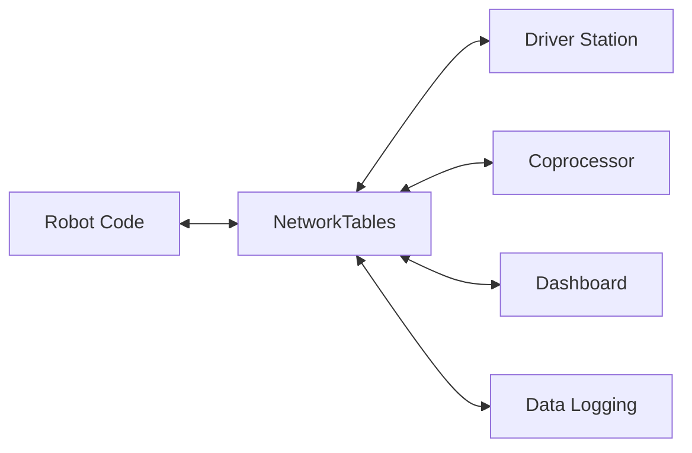

NetworkTables Core (ntcore) provides a high-performance, real-time publish-subscribe protocol for communication between robot components, driver stations, and coprocessors.

## Overview

NetworkTables is WPILib's primary communication protocol, enabling:
- Automatic data synchronization across network
- Publisher-subscriber pattern for loose coupling
- Type-safe data exchange
- Dashboard integration (Shuffleboard, SmartDashboard)
- Vision coprocessor communication
- Robot-to-robot communication

## Architecture



## Core Concepts

<CardGroup cols={2}>
  <Card title="Topics" icon="tag" href="#topics">
    Named data channels for publishing/subscribing
  </Card>
  <Card title="Publishers" icon="paper-plane" href="#publishers">
    Send data to a topic
  </Card>
  <Card title="Subscribers" icon="inbox" href="#subscribers">
    Receive data from a topic
  </Card>
  <Card title="Entries" icon="arrows-left-right" href="#entries">
    Combined publisher and subscriber
  </Card>
</CardGroup>

## Basic Usage

### Java API

```java
import edu.wpi.first.networktables.*;

// Get default instance
NetworkTableInstance inst = NetworkTableInstance.getDefault();

// Get a table
NetworkTable table = inst.getTable("datatable");

// Publish values
DoublePublisher xPub = table.getDoubleTopic("x").publish();
xPub.set(1.0);

// Subscribe to values
DoubleSubscriber xSub = table.getDoubleTopic("x").subscribe(0.0);
double value = xSub.get();

// Use entries (publish + subscribe)
DoubleEntry xEntry = table.getDoubleTopic("x").getEntry(0.0);
xEntry.set(2.0);
double x = xEntry.get();
```

### C++ API

```cpp
#include <networktables/NetworkTableInstance.h>
#include <networktables/NetworkTable.h>
#include <networktables/DoubleTopic.h>

// Get default instance
nt::NetworkTableInstance inst = nt::NetworkTableInstance::GetDefault();

// Get a table
std::shared_ptr<nt::NetworkTable> table = inst.GetTable("datatable");

// Publish values
nt::DoublePublisher xPub = table->GetDoubleTopic("x").Publish();
xPub.Set(1.0);

// Subscribe to values
nt::DoubleSubscriber xSub = table->GetDoubleTopic("x").Subscribe(0.0);
double value = xSub.Get();

// Use entries
nt::DoubleEntry xEntry = table->GetDoubleTopic("x").GetEntry(0.0);
xEntry.Set(2.0);
double x = xEntry.Get();
```

## Topics

Topics are named data channels. Each topic has a specific data type.

### Topic Types

| Type | Java | C++ | Description |
|------|------|-----|-------------|
| Boolean | `BooleanTopic` | `BooleanTopic` | true/false values |
| Integer | `IntegerTopic` | `IntegerTopic` | 64-bit integers |
| Float | `FloatTopic` | `FloatTopic` | 32-bit floating point |
| Double | `DoubleTopic` | `DoubleTopic` | 64-bit floating point |
| String | `StringTopic` | `StringTopic` | Text strings |
| Boolean Array | `BooleanArrayTopic` | `BooleanArrayTopic` | Array of booleans |
| Integer Array | `IntegerArrayTopic` | `IntegerArrayTopic` | Array of integers |
| Float Array | `FloatArrayTopic` | `FloatArrayTopic` | Array of floats |
| Double Array | `DoubleArrayTopic` | `DoubleArrayTopic` | Array of doubles |
| String Array | `StringArrayTopic` | `StringArrayTopic` | Array of strings |
| Raw | `RawTopic` | `RawTopic` | Binary data |
| Struct | `StructTopic<T>` | `StructTopic<T>` | Serialized structs |
| Protobuf | `ProtobufTopic<T>` | `ProtobufTopic<T>` | Protocol buffers |

### Getting Topics

```java
// From table
NetworkTable table = inst.getTable("mytable");
DoubleTopic topic = table.getDoubleTopic("value");

// Directly from instance
DoubleTopic topic2 = inst.getDoubleTopic("/mytable/value");

// Topic info
String name = topic.getName();  // "/mytable/value"
String type = topic.getType();  // "double"
```

## Publishers

Publishers send data to a topic.

### Publishing Data

```java
// Create publisher
DoublePublisher pub = topic.publish();

// Publish with options
PubSubOption[] options = {
    PubSubOption.periodic(0.01),      // Publish every 10ms
    PubSubOption.sendAll(true),       // Send all value changes
    PubSubOption.keepDuplicates(true) // Keep duplicate values
};
DoublePublisher pub2 = topic.publish(options);

// Set values
pub.set(1.5);
pub.set(2.5, timestampMicros);

// Close publisher
pub.close();
```

```cpp
// Create publisher
nt::DoublePublisher pub = topic.Publish();

// Publish with options
nt::DoublePublisher pub2 = topic.Publish(
    {{"periodic", 0.01}});

// Set values
pub.Set(1.5);
pub.Set(2.5, timestampMicros);
```

### Array Publishers

```java
// Double array
DoubleArrayPublisher arrayPub = topic.publish();
arrayPub.set(new double[]{1.0, 2.0, 3.0});

// String array
StringArrayPublisher stringPub = stringTopic.publish();
stringPub.set(new String[]{"a", "b", "c"});
```

## Subscribers

Subscribers receive data from a topic.

### Subscribing to Data

```java
// Create subscriber with default value
DoubleSubscriber sub = topic.subscribe(0.0);

// Subscribe with options
PubSubOption[] options = {
    PubSubOption.pollStorage(10),     // Buffer size
    PubSubOption.periodic(0.02)       // Update rate
};
DoubleSubscriber sub2 = topic.subscribe(0.0, options);

// Get latest value
double value = sub.get();

// Get with default if no value
double value2 = sub.get(99.9);

// Check if value exists
boolean exists = sub.exists();

// Get timestamped value
TimestampedDouble tValue = sub.getAtomic();
double val = tValue.value;
long timestamp = tValue.timestamp;
long serverTime = tValue.serverTime;

// Close subscriber
sub.close();
```

### Reading All Updates

```java
// Get all value changes since last read
TimestampedDouble[] values = sub.readQueue();
for (TimestampedDouble val : values) {
    System.out.println(val.value + " at " + val.timestamp);
}
```

## Entries

Entries combine publisher and subscriber functionality.

```java
// Create entry
DoubleEntry entry = topic.getEntry(0.0);

// Read value
double value = entry.get();

// Write value  
entry.set(2.5);

// Set default (published if topic doesn't exist)
entry.setDefault(1.0);

// Atomic get and set
entry.set(entry.get() + 1.0);
```

## Struct Topics

Publish custom structs with type safety.

```java
import edu.wpi.first.math.geometry.Pose2d;
import edu.wpi.first.util.struct.Struct;

// Publish Pose2d (has built-in struct support)
StructTopic<Pose2d> poseTopic = 
    inst.getStructTopic("pose", Pose2d.struct);
StructPublisher<Pose2d> posePub = poseTopic.publish();
posePub.set(new Pose2d(1.0, 2.0, new Rotation2d()));

// Subscribe to Pose2d
StructSubscriber<Pose2d> poseSub = 
    poseTopic.subscribe(new Pose2d());
Pose2d pose = poseSub.get();
```

```cpp
#include <frc/geometry/Pose2d.h>

// Publish Pose2d
nt::StructTopic<frc::Pose2d> poseTopic = 
    inst.GetStructTopic<frc::Pose2d>("pose");
nt::StructPublisher<frc::Pose2d> posePub = poseTopic.Publish();
posePub.Set(frc::Pose2d{1.0_m, 2.0_m, frc::Rotation2d{}});

// Subscribe to Pose2d
nt::StructSubscriber<frc::Pose2d> poseSub = poseTopic.Subscribe({});
frc::Pose2d pose = poseSub.Get();
```

## NetworkTableInstance

Manages NetworkTables connections and configuration.

### Client/Server Mode

```java
NetworkTableInstance inst = NetworkTableInstance.getDefault();

// Start as client (coprocessor, dashboard)
inst.startClient4("myclient");
inst.setServerTeam(1234);  // Team number
// or
inst.setServer("10.12.34.2");  // IP address

// Start as server (robot)
inst.startServer();

// Stop
inst.stopClient();
inst.stopServer();
```

```cpp
nt::NetworkTableInstance inst = nt::NetworkTableInstance::GetDefault();

// Start as client
inst.StartClient4("myclient");
inst.SetServerTeam(1234);
// or
inst.SetServer("10.12.34.2");

// Start as server
inst.StartServer();
```

### Connection Listeners

```java
int listenerId = inst.addConnectionListener(true, event -> {
    if (event.is(NetworkTableEvent.Kind.kConnected)) {
        System.out.println("Connected to server");
    } else if (event.is(NetworkTableEvent.Kind.kDisconnected)) {
        System.out.println("Disconnected from server");
    }
});

// Remove listener
inst.removeListener(listenerId);
```

## Listeners

### Value Change Listeners

```java
// Listen to value changes
int listenerId = sub.addListener(event -> {
    System.out.println("New value: " + event.value.getDouble());
}, EnumSet.of(NetworkTableEvent.Kind.kValueAll));

// Remove listener
sub.removeListener(listenerId);
```

### Topic Listeners

```java
// Listen for new topics
int listenerId = inst.addListener(
    new String[]{"/vision/"},  // Topic prefix
    EnumSet.of(NetworkTableEvent.Kind.kPublish),
    event -> {
        System.out.println("New topic: " + event.topicInfo.name);
    }
);
```

## Querying Topics

```java
// Get all topics
TopicInfo[] topics = inst.getTopics();
for (TopicInfo info : topics) {
    System.out.println(info.name + ": " + info.type);
}

// Get topics by prefix
TopicInfo[] visionTopics = inst.getTopics("/vision/");

// Get topic info
Topic topic = inst.getTopic("/mytable/value");
TopicInfo info = topic.getInfo();
String name = info.name;
String type = info.type;
boolean retained = info.retained;
```

## Properties

### Topic Properties

```java
// Set properties when publishing
PubSubOption[] options = {
    PubSubOption.retained(true),      // Retain value across connections
    PubSubOption.persistent(true)     // Save to persistent storage
};
DoublePublisher pub = topic.publish(options);

// Set properties on topic
topic.setProperty("units", "meters");
topic.setProperty("min", -10.0);
topic.setProperty("max", 10.0);

// Get properties
String units = topic.getProperty("units");
```

## Data Logging

NetworkTables can log data to DataLog files.

```java
import edu.wpi.first.util.datalog.DataLog;
import edu.wpi.first.networktables.DataLogManager;

// Start logging all NetworkTables data
DataLogManager.start();

// Custom log directory
DataLogManager.start("/home/lvuser/logs");

// Log specific entry
DataLog log = DataLogManager.getLog();
DoubleLogEntry logEntry = new DoubleLogEntry(log, "/drive/velocity");
logEntry.append(velocity);
```

## Best Practices

### Naming Conventions

```java
// Use hierarchical naming
NetworkTable subsystem = inst.getTable("drivetrain");
DoublePublisher leftVelocity = subsystem.getDoubleTopic("left/velocity").publish();
DoublePublisher rightVelocity = subsystem.getDoubleTopic("right/velocity").publish();

// Results in topics:
// /drivetrain/left/velocity
// /drivetrain/right/velocity
```

### Performance Tips

```java
// Cache publishers/subscribers
private final DoublePublisher velocityPub = 
    table.getDoubleTopic("velocity").publish();

// Don't create publishers in loops
public void periodic() {
    velocityPub.set(getVelocity());  // Good
    // table.getDoubleTopic("velocity").publish().set(getVelocity());  // Bad!
}

// Use struct topics for complex data instead of multiple topics
StructPublisher<Pose2d> posePub = 
    inst.getStructTopic("pose", Pose2d.struct).publish();
posePub.set(pose);  // One publish instead of 3
```

### Resource Management

```java
// Close publishers/subscribers when done
public void close() {
    velocityPub.close();
    poseSub.close();
}

// Or use try-with-resources
try (DoublePublisher pub = topic.publish()) {
    pub.set(1.0);
}
```

## Integration with Dashboards

### Shuffleboard

```java
import edu.wpi.first.wpilibj.shuffleboard.*;

// Automatically publishes to NetworkTables
ShuffleboardTab tab = Shuffleboard.getTab("Drive");
tab.add("Velocity", 0.0);
tab.add("Enabled", false);
```

### SmartDashboard

```java
import edu.wpi.first.wpilibj.smartdashboard.SmartDashboard;

// Legacy API (uses NetworkTables internally)
SmartDashboard.putNumber("Velocity", velocity);
double value = SmartDashboard.getNumber("Velocity", 0.0);
```

## Vision Processing

```java
// Robot side
NetworkTable visionTable = inst.getTable("vision");
DoubleArraySubscriber targetsSub = 
    visionTable.getDoubleArrayTopic("targets").subscribe(new double[0]);

// Coprocessor side
NetworkTableInstance.getDefault().startClient4("vision");
NetworkTableInstance.getDefault().setServerTeam(1234);

NetworkTable visionTable = inst.getTable("vision");
DoubleArrayPublisher targetsPub = 
    visionTable.getDoubleArrayTopic("targets").publish();
targetsPub.set(new double[]{x, y, distance});
```

## C API

For C programs, ntcore provides a C API.

```c
#include <ntcore_c.h>

// Get default instance
NT_Inst inst = NT_GetDefaultInstance();

// Publish value
NT_Topic topic = NT_GetTopic(inst, "/datatable/x");
NT_Publisher pub = NT_Publish(topic, NT_DOUBLE, "double", NULL, 0);
NT_SetDouble(pub, 0, 1.5);

// Subscribe to value
NT_Subscriber sub = NT_Subscribe(topic, NT_DOUBLE, "double", NULL, 0);
double value = NT_GetDouble(sub, 0.0);
```

## Source Code

View the full source code on GitHub:
- [NetworkTables Java](https://github.com/wpilibsuite/allwpilib/tree/main/ntcore/src/main/java/edu/wpi/first/networktables)
- [NetworkTables C++](https://github.com/wpilibsuite/allwpilib/tree/main/ntcore/src/main/native/include/networktables)
- [NetworkTables C API](https://github.com/wpilibsuite/allwpilib/tree/main/ntcore/src/main/native/include/ntcore_c.h)

## Related Documentation

<CardGroup cols={2}>
  <Card title="WPIUtil" icon="toolbox" href="/api/wpiutil/overview">
    Utilities including data logging
  </Card>
  <Card title="WPILibJ" icon="java" href="/api/wpilibj/overview">
    Java robot API using NetworkTables
  </Card>
  <Card title="WPILibC" icon="c" href="/api/wpilibc/overview">
    C++ robot API using NetworkTables
  </Card>
</CardGroup>
