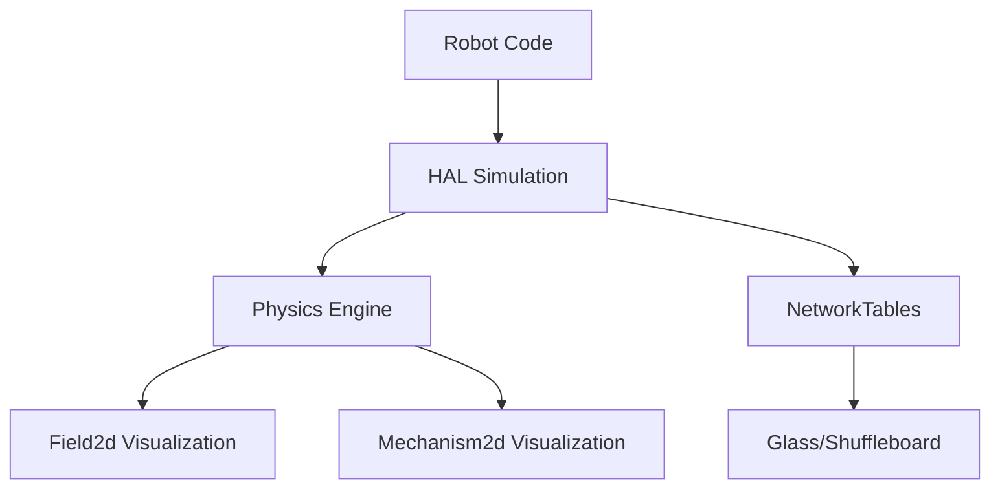

The WPILib Simulation API enables testing robot code on a desktop computer without physical hardware, accelerating development and enabling continuous integration testing.

## Overview

Robot simulation provides:
- Test code without physical robot
- Rapid iteration during development
- Physics-based simulation
- Visualization with Glass GUI
- Integration with CI/CD pipelines
- Field visualization
- Mechanism visualization

## Architecture



## Core Concepts

<CardGroup cols={2}>
  <Card title="HAL Simulation" icon="microchip" href="#hal-simulation">
    Simulated hardware abstraction layer
  </Card>
  <Card title="Physics Simulation" icon="atom" href="#physics-simulation">
    Model robot physics and mechanisms
  </Card>
  <Card title="Field2d" icon="map" href="#field2d">
    Visualize robot position on field
  </Card>
  <Card title="Mechanism2d" icon="gear" href="#mechanism2d">
    Visualize robot mechanisms
  </Card>
</CardGroup>

## Running Simulation

### VS Code

1. Press `Ctrl+Shift+P` (or `Cmd+Shift+P` on macOS)
2. Type "WPILib: Simulate Robot Code"
3. Select "Sim GUI" or "Command Line"
4. Robot code runs in simulation mode

### Command Line

```bash
# Gradle (Java)
./gradlew simulateJava

# Desktop build (C++)
./gradlew runCpp
```

## HAL Simulation

Access and control simulated hardware.

### Motor Simulation (Java)

```java
import edu.wpi.first.wpilibj.simulation.PWMSim;
import edu.wpi.first.wpilibj.motorcontrol.PWMSparkMax;

public class DriveSubsystem extends SubsystemBase {
  private final PWMSparkMax leftMotor = new PWMSparkMax(0);
  private final PWMSparkMax rightMotor = new PWMSparkMax(1);
  
  // Simulation support
  private PWMSim leftMotorSim;
  private PWMSim rightMotorSim;
  
  public DriveSubsystem() {
    // Only create sims when running in simulation
    if (RobotBase.isSimulation()) {
      leftMotorSim = new PWMSim(leftMotor);
      rightMotorSim = new PWMSim(rightMotor);
    }
  }
  
  @Override
  public void simulationPeriodic() {
    // Get motor outputs for physics simulation
    double leftSpeed = leftMotorSim.getSpeed();
    double rightSpeed = rightMotorSim.getSpeed();
    
    // Use in physics simulation...
  }
}
```

### Encoder Simulation (Java)

```java
import edu.wpi.first.wpilibj.Encoder;
import edu.wpi.first.wpilibj.simulation.EncoderSim;

public class DriveSubsystem extends SubsystemBase {
  private final Encoder leftEncoder = new Encoder(0, 1);
  private EncoderSim leftEncoderSim;
  
  public DriveSubsystem() {
    if (RobotBase.isSimulation()) {
      leftEncoderSim = new EncoderSim(leftEncoder);
    }
  }
  
  @Override
  public void simulationPeriodic() {
    // Update encoder based on simulated motion
    double simulatedDistance = calculateDistance();
    leftEncoderSim.setDistance(simulatedDistance);
    
    // Or set rate
    leftEncoderSim.setRate(motorSpeed * gearRatio);
  }
}
```

### Gyro Simulation (Java)

```java
import edu.wpi.first.wpilibj.ADXRS450_Gyro;
import edu.wpi.first.wpilibj.simulation.ADXRS450_GyroSim;

private final ADXRS450_Gyro gyro = new ADXRS450_Gyro();
private ADXRS450_GyroSim gyroSim;

public DriveSubsystem() {
  if (RobotBase.isSimulation()) {
    gyroSim = new ADXRS450_GyroSim(gyro);
  }
}

@Override
public void simulationPeriodic() {
  // Update gyro angle based on rotation
  gyroSim.setAngle(simulatedAngle);
  
  // Or set rate
  gyroSim.setRate(angularVelocity);
}
```

### Available Simulated Devices

| Java Class | Simulates |
|------------|----------|
| `PWMSim` | PWM motor controllers |
| `EncoderSim` | Quadrature encoders |
| `DutyCycleEncoderSim` | Duty cycle encoders |
| `AnalogInputSim` | Analog inputs |
| `AnalogGyroSim` | Analog gyroscopes |
| `ADXRS450_GyroSim` | ADXRS450 SPI gyro |
| `DigitalInputSim` | Digital inputs |
| `DigitalOutputSim` | Digital outputs |
| `SolenoidSim` | Pneumatic solenoids |
| `DoubleSolenoidSim` | Double solenoids |

## Physics Simulation

Model robot physics for realistic simulation.

### Drivetrain Physics (Java)

```java
import edu.wpi.first.wpilibj.simulation.DifferentialDrivetrainSim;
import edu.wpi.first.wpilibj.system.plant.DCMotor;
import edu.wpi.first.math.system.plant.LinearSystemId;
import edu.wpi.first.math.util.Units;

public class DriveSubsystem extends SubsystemBase {
  private DifferentialDrivetrainSim drivetrainSim;
  
  public DriveSubsystem() {
    if (RobotBase.isSimulation()) {
      // Create drivetrain simulation
      drivetrainSim = new DifferentialDrivetrainSim(
          // Drivetrain model
          LinearSystemId.identifyDrivetrainSystem(
              1.5,    // kV (volts per meter/sec)
              0.3,    // kA (volts per meter/sec²)
              1.5,    // kVangular
              0.3     // kAangular
          ),
          DCMotor.getNEO(2),           // 2 NEO motors per side
          8.0,                         // Gear ratio
          Units.inchesToMeters(26),    // Track width
          Units.inchesToMeters(3),     // Wheel radius
          null                         // Measurement noise (optional)
      );
    }
  }
  
  @Override
  public void simulationPeriodic() {
    // Update simulation with motor voltages
    drivetrainSim.setInputs(
        leftMotor.get() * RobotController.getBatteryVoltage(),
        rightMotor.get() * RobotController.getBatteryVoltage()
    );
    
    // Advance simulation by 20ms
    drivetrainSim.update(0.02);
    
    // Update encoder simulations
    leftEncoderSim.setDistance(
        drivetrainSim.getLeftPositionMeters());
    rightEncoderSim.setDistance(
        drivetrainSim.getRightPositionMeters());
    
    // Update gyro simulation
    gyroSim.setAngle(-drivetrainSim.getHeading().getDegrees());
  }
}
```

### Single Jointed Arm (Java)

```java
import edu.wpi.first.wpilibj.simulation.SingleJointedArmSim;
import edu.wpi.first.math.system.plant.DCMotor;
import edu.wpi.first.math.util.Units;

private SingleJointedArmSim armSim;

public ArmSubsystem() {
  if (RobotBase.isSimulation()) {
    armSim = new SingleJointedArmSim(
        DCMotor.getNEO(1),              // Motor
        100.0,                          // Gear ratio
        SingleJointedArmSim.estimateMOI(
            Units.inchesToMeters(30),   // Arm length
            5.0                         // Arm mass (kg)
        ),
        Units.inchesToMeters(30),       // Arm length
        Units.degreesToRadians(-90),    // Min angle
        Units.degreesToRadians(90),     // Max angle
        true,                           // Simulate gravity
        Units.degreesToRadians(0)       // Starting angle
    );
  }
}

@Override
public void simulationPeriodic() {
  armSim.setInput(motor.get() * RobotController.getBatteryVoltage());
  armSim.update(0.02);
  
  // Update encoder
  encoderSim.setDistance(armSim.getAngleRads());
}
```

### Elevator Simulation (Java)

```java
import edu.wpi.first.wpilibj.simulation.ElevatorSim;
import edu.wpi.first.math.system.plant.DCMotor;

private ElevatorSim elevatorSim;

public ElevatorSubsystem() {
  if (RobotBase.isSimulation()) {
    elevatorSim = new ElevatorSim(
        DCMotor.getNEO(2),              // 2 NEO motors
        10.0,                           // Gear ratio
        10.0,                           // Carriage mass (kg)
        Units.inchesToMeters(1),        // Drum radius
        0.0,                            // Min height
        Units.inchesToMeters(60),       // Max height
        true,                           // Simulate gravity
        0.0                             // Starting height
    );
  }
}

@Override
public void simulationPeriodic() {
  elevatorSim.setInput(motor.get() * RobotController.getBatteryVoltage());
  elevatorSim.update(0.02);
  encoderSim.setDistance(elevatorSim.getPositionMeters());
}
```

### Flywheel Simulation (Java)

```java
import edu.wpi.first.wpilibj.simulation.FlywheelSim;
import edu.wpi.first.math.system.plant.DCMotor;

private FlywheelSim flywheelSim;

public ShooterSubsystem() {
  if (RobotBase.isSimulation()) {
    flywheelSim = new FlywheelSim(
        LinearSystemId.identifyVelocitySystem(0.02, 0.001),
        DCMotor.getNEO(2),    // 2 NEO motors
        1.0                   // Gear ratio
    );
  }
}

@Override
public void simulationPeriodic() {
  flywheelSim.setInput(motor.get() * RobotController.getBatteryVoltage());
  flywheelSim.update(0.02);
  encoderSim.setRate(flywheelSim.getAngularVelocityRPM());
}
```

## Field2d

Visualize robot position on the field.

```java
import edu.wpi.first.wpilibj.smartdashboard.Field2d;
import edu.wpi.first.wpilibj.smartdashboard.SmartDashboard;
import edu.wpi.first.math.geometry.Pose2d;

public class DriveSubsystem extends SubsystemBase {
  private final Field2d field = new Field2d();
  
  public DriveSubsystem() {
    // Send to dashboard
    SmartDashboard.putData("Field", field);
  }
  
  @Override
  public void periodic() {
    // Update robot pose on field
    field.setRobotPose(odometry.getPoseMeters());
  }
  
  // Add trajectory visualization
  public void setTrajectory(Trajectory trajectory) {
    field.getObject("traj").setTrajectory(trajectory);
  }
  
  // Add custom objects
  public void addVisionTarget(Pose2d pose) {
    field.getObject("target").setPose(pose);
  }
}
```

## Mechanism2d

Visualize robot mechanisms.

```java
import edu.wpi.first.wpilibj.smartdashboard.Mechanism2d;
import edu.wpi.first.wpilibj.smartdashboard.MechanismLigament2d;
import edu.wpi.first.wpilibj.smartdashboard.MechanismRoot2d;
import edu.wpi.first.wpilibj.util.Color8Bit;
import edu.wpi.first.wpilibj.util.Color;

public class ArmSubsystem extends SubsystemBase {
  // Create mechanism canvas (width, height in inches)
  private final Mechanism2d mech = new Mechanism2d(60, 60);
  
  // Create root at bottom center
  private final MechanismRoot2d root = mech.getRoot("arm", 30, 0);
  
  // Create arm ligament
  private final MechanismLigament2d arm = root.append(
      new MechanismLigament2d(
          "arm",
          30,                           // Length (inches)
          0,                            // Initial angle (degrees)
          6,                            // Line width
          new Color8Bit(Color.kBlue)
      )
  );
  
  // Create claw at end of arm
  private final MechanismLigament2d claw = arm.append(
      new MechanismLigament2d(
          "claw",
          5,
          90,
          4,
          new Color8Bit(Color.kGreen)
      )
  );
  
  public ArmSubsystem() {
    SmartDashboard.putData("Arm Mechanism", mech);
  }
  
  @Override
  public void periodic() {
    // Update arm angle
    arm.setAngle(getArmAngleDegrees());
    
    // Update claw state
    claw.setColor(isClawOpen() 
        ? new Color8Bit(Color.kGreen) 
        : new Color8Bit(Color.kRed));
  }
}
```

### Complex Mechanism Example

```java
public class RobotMechanism {
  private final Mechanism2d mech = new Mechanism2d(100, 100);
  
  // Drivetrain base
  private final MechanismRoot2d driveBase = mech.getRoot("drive", 50, 10);
  private final MechanismLigament2d chassis = driveBase.append(
      new MechanismLigament2d("chassis", 30, 90, 10, 
                              new Color8Bit(Color.kGray)));
  
  // Elevator
  private final MechanismLigament2d elevator = chassis.append(
      new MechanismLigament2d("elevator", 0, 90, 8,
                              new Color8Bit(Color.kYellow)));
  
  // Arm on elevator
  private final MechanismLigament2d arm = elevator.append(
      new MechanismLigament2d("arm", 20, 0, 6,
                              new Color8Bit(Color.kBlue)));
  
  // Intake/claw
  private final MechanismLigament2d intake = arm.append(
      new MechanismLigament2d("intake", 8, 0, 4,
                              new Color8Bit(Color.kGreen)));
  
  public void update(double elevatorHeight, double armAngle, boolean intakeDeployed) {
    elevator.setLength(elevatorHeight);
    arm.setAngle(armAngle);
    intake.setAngle(intakeDeployed ? 45 : 0);
  }
}
```

## Simulation-Specific Code

Detect and handle simulation mode.

```java
import edu.wpi.first.wpilibj.RobotBase;

public class Robot extends TimedRobot {
  @Override
  public void robotInit() {
    if (RobotBase.isSimulation()) {
      // Simulation-only initialization
      setupSimulation();
    } else {
      // Real robot initialization
      setupRealHardware();
    }
  }
  
  @Override
  public void simulationInit() {
    // Called once when simulation starts
  }
  
  @Override
  public void simulationPeriodic() {
    // Called every 20ms in simulation
    // Update physics simulations here
  }
}
```

## Testing with Simulation

### Unit Tests

```java
import org.junit.jupiter.api.Test;
import edu.wpi.first.hal.HAL;
import edu.wpi.first.wpilibj.simulation.*;

class DriveSubsystemTest {
  @Test
  void testDriveForward() {
    HAL.initialize(500, 0);  // Initialize HAL for testing
    
    DriveSubsystem drive = new DriveSubsystem();
    
    // Command to drive
    drive.arcadeDrive(0.5, 0);
    
    // Simulate and verify
    // ...
  }
}
```

## Glass GUI

Visual debugging tool for simulation.

### Launch Glass

1. Run simulation
2. Glass opens automatically
3. View NetworkTables, plots, and visualizations

### Glass Features

- NetworkTables viewer
- Field2d visualization
- Mechanism2d visualization  
- Plot values over time
- Joystick/gamepad input
- System metrics

## C++ Simulation

```cpp
#include <frc/simulation/DifferentialDrivetrainSim.h>
#include <frc/simulation/EncoderSim.h>
#include <frc/simulation/PWMSim.h>

class DriveSubsystem : public frc2::SubsystemBase {
 public:
  void SimulationPeriodic() override {
#ifdef SIMULATION
    // Update simulation
    m_drivetrainSim.SetInputs(
        m_leftMotor.Get() * frc::RobotController::GetBatteryVoltage(),
        m_rightMotor.Get() * frc::RobotController::GetBatteryVoltage()
    );
    
    m_drivetrainSim.Update(20_ms);
    
    // Update encoders
    m_leftEncoderSim.SetDistance(m_drivetrainSim.GetLeftPosition().value());
    m_rightEncoderSim.SetDistance(m_drivetrainSim.GetRightPosition().value());
#endif
  }
  
 private:
#ifdef SIMULATION
  frc::sim::DifferentialDrivetrainSim m_drivetrainSim{...};
  frc::sim::EncoderSim m_leftEncoderSim{m_leftEncoder};
  frc::sim::EncoderSim m_rightEncoderSim{m_rightEncoder};
#endif
};
```

## Source Code

View the full source code on GitHub:
- [Simulation Java](https://github.com/wpilibsuite/allwpilib/tree/main/wpilibj/src/main/java/edu/wpi/first/wpilibj/simulation)
- [Simulation C++](https://github.com/wpilibsuite/allwpilib/tree/main/wpilibc/src/main/native/include/frc/simulation)
- [HAL Simulation](https://github.com/wpilibsuite/allwpilib/tree/main/hal/src/main/native/sim)

## Related Documentation

<CardGroup cols={2}>
  <Card title="WPIMath" icon="square-root-variable" href="/api/wpimath/overview">
    Physics models and system identification
  </Card>
  <Card title="HAL" icon="microchip" href="/api/hal/overview">
    Hardware abstraction layer
  </Card>
  <Card title="Testing" icon="vial" href="/docs/testing">
    Unit testing robot code
  </Card>
</CardGroup>
