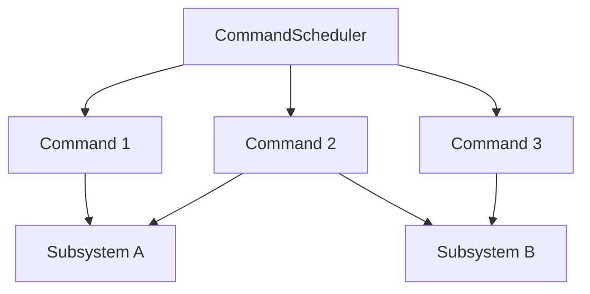

The Command Framework (wpilibNewCommands) provides a structured approach to organizing robot code using the Command design pattern.

## Overview

The Command Framework helps you:
- Organize robot code into reusable commands
- Manage subsystem resource allocation
- Schedule concurrent and sequential operations
- Create complex autonomous routines
- Bind commands to driver inputs
- Implement state machines and behaviors

## Architecture



## Core Concepts

<CardGroup cols={2}>
  <Card title="Commands" icon="terminal" href="#commands">
    Reusable robot actions and behaviors
  </Card>
  <Card title="Subsystems" icon="layer-group" href="#subsystems">
    Robot hardware groupings
  </Card>
  <Card title="Command Scheduler" icon="clock" href="#command-scheduler">
    Manages command execution
  </Card>
  <Card title="Command Composition" icon="diagram-project" href="#command-composition">
    Combine commands into complex behaviors
  </Card>
</CardGroup>

## Subsystems

Subsystems represent distinct robot mechanisms.

### Creating a Subsystem (Java)

```java
import edu.wpi.first.wpilibj2.command.SubsystemBase;
import edu.wpi.first.wpilibj.motorcontrol.Spark;

public class DriveSubsystem extends SubsystemBase {
  private final Spark leftMotor = new Spark(0);
  private final Spark rightMotor = new Spark(1);
  
  public DriveSubsystem() {
    // Configure motors
    rightMotor.setInverted(true);
  }
  
  // Command methods
  public void arcadeDrive(double forward, double rotation) {
    double left = forward + rotation;
    double right = forward - rotation;
    leftMotor.set(left);
    rightMotor.set(right);
  }
  
  public void stop() {
    leftMotor.set(0);
    rightMotor.set(0);
  }
  
  @Override
  public void periodic() {
    // Called every 20ms - update telemetry, etc.
  }
}
```

### Creating a Subsystem (C++)

```cpp
#include <frc2/command/SubsystemBase.h>
#include <frc/motorcontrol/Spark.h>

class DriveSubsystem : public frc2::SubsystemBase {
 public:
  DriveSubsystem() {
    m_rightMotor.SetInverted(true);
  }
  
  void ArcadeDrive(double forward, double rotation) {
    double left = forward + rotation;
    double right = forward - rotation;
    m_leftMotor.Set(left);
    m_rightMotor.Set(right);
  }
  
  void Stop() {
    m_leftMotor.Set(0);
    m_rightMotor.Set(0);
  }
  
  void Periodic() override {
    // Called every 20ms
  }
  
 private:
  frc::Spark m_leftMotor{0};
  frc::Spark m_rightMotor{1};
};
```

## Commands

Commands are actions that use subsystems.

### Command Lifecycle

```java
import edu.wpi.first.wpilibj2.command.Command;

public class MyCommand extends Command {
  @Override
  public void initialize() {
    // Called once when command starts
  }
  
  @Override
  public void execute() {
    // Called repeatedly (every 20ms) while command runs
  }
  
  @Override
  public void end(boolean interrupted) {
    // Called once when command ends
    // interrupted = true if command was interrupted
  }
  
  @Override
  public boolean isFinished() {
    // Return true to end command
    return false;
  }
}
```

### Inline Commands (Java)

```java
import edu.wpi.first.wpilibj2.command.*;

public class DriveCommands {
  private final DriveSubsystem drive;
  
  // Inline command using method references
  public Command driveForward() {
    return run(() -> drive.arcadeDrive(0.5, 0), drive)
        .withTimeout(2.0);
  }
  
  // One-time action
  public Command resetEncoders() {
    return runOnce(() -> drive.resetEncoders(), drive);
  }
  
  // Run until condition
  public Command driveUntilDistance(double distance) {
    return run(() -> drive.arcadeDrive(0.3, 0), drive)
        .until(() -> drive.getDistance() >= distance);
  }
}
```

### Command Factories (C++)

```cpp
#include <frc2/command/Commands.h>

frc2::CommandPtr DriveForward(DriveSubsystem* drive) {
  return frc2::cmd::Run(
      [drive] { drive->ArcadeDrive(0.5, 0); },
      {drive}
  ).WithTimeout(2.0_s);
}

frc2::CommandPtr ResetEncoders(DriveSubsystem* drive) {
  return frc2::cmd::RunOnce(
      [drive] { drive->ResetEncoders(); },
      {drive}
  );
}
```

## Built-in Command Types

### InstantCommand

Runs once and finishes immediately.

```java
// Java
new InstantCommand(() -> intake.deploy(), intake);

// Or as factory method
Commands.runOnce(() -> intake.deploy(), intake);
```

```cpp
// C++
frc2::InstantCommand([this] { m_intake.Deploy(); }, {&m_intake});

// Or as factory
frc2::cmd::RunOnce([this] { m_intake.Deploy(); }, {&m_intake});
```

### RunCommand

Runs continuously until interrupted.

```java
// Java - default command for teleop
drive.setDefaultCommand(
    new RunCommand(
        () -> drive.arcadeDrive(
            -controller.getLeftY(),
            -controller.getRightX()
        ),
        drive
    )
);
```

```cpp
// C++
m_drive.SetDefaultCommand(
    frc2::RunCommand(
        [this] {
            m_drive.ArcadeDrive(
                -m_controller.GetLeftY(),
                -m_controller.GetRightX()
            );
        },
        {&m_drive}
    )
);
```

### FunctionalCommand

Full control over command lifecycle.

```java
new FunctionalCommand(
    // initialize
    () -> shooter.setSpeed(5000),
    // execute
    () -> {},
    // end
    interrupted -> shooter.stop(),
    // isFinished
    () -> shooter.atSpeed(),
    // requirements
    shooter
);
```

### StartEndCommand

Runs one action at start, another at end.

```java
new StartEndCommand(
    () -> intake.setPower(1.0),  // Start
    () -> intake.setPower(0.0),  // End
    intake
);
```

## Command Composition

### Sequential Commands

Run commands one after another.

```java
import edu.wpi.first.wpilibj2.command.SequentialCommandGroup;

// Traditional syntax
new SequentialCommandGroup(
    driveForward(2.0),
    turnRight(90),
    driveForward(1.0)
);

// Inline syntax
driveForward(2.0)
    .andThen(turnRight(90))
    .andThen(driveForward(1.0));

// Factory method
Commands.sequence(
    driveForward(2.0),
    turnRight(90),
    driveForward(1.0)
);
```

```cpp
// C++
frc2::SequentialCommandGroup{
    DriveForward(2.0_m),
    TurnRight(90_deg),
    DriveForward(1.0_m)
};

// Or with AndThen
DriveForward(2.0_m)
    .AndThen(TurnRight(90_deg))
    .AndThen(DriveForward(1.0_m));
```

### Parallel Commands

Run commands simultaneously.

```java
import edu.wpi.first.wpilibj2.command.ParallelCommandGroup;

// Run until all finish
new ParallelCommandGroup(
    spinUpShooter(),
    aimTurret(),
    runConveyor()
);

// Inline
spinUpShooter()
    .alongWith(aimTurret())
    .alongWith(runConveyor());
```

### Parallel Race

Run until first command finishes.

```java
import edu.wpi.first.wpilibj2.command.ParallelRaceGroup;

// Drive forward while intaking, stop when either finishes
new ParallelRaceGroup(
    driveForward(3.0),
    runIntake()
);

// Inline
driveForward(3.0)
    .raceWith(runIntake());
```

### Parallel Deadline

Run until deadline command finishes.

```java
import edu.wpi.first.wpilibj2.command.ParallelDeadlineGroup;

// Run intake and conveyor until drive finishes
new ParallelDeadlineGroup(
    driveForward(2.0),  // Deadline
    runIntake(),
    runConveyor()
);

// Inline
driveForward(2.0)
    .deadlineWith(runIntake(), runConveyor());
```

## Command Decorators

### Timeouts

```java
// Run for maximum 2 seconds
driveForward().withTimeout(2.0);
```

### Conditions

```java
// Run until condition true
driveForward().until(() -> drive.getDistance() > 2.0);

// Only run if condition true
shoot().onlyIf(() -> shooter.hasTarget());

// Only run while condition true
intake().onlyWhile(() -> !storage.isFull());
```

### Repeat

```java
// Repeat forever
flashLights().repeatedly();

// Repeat N times
shoot().repeatedly().withTimeout(5.0);
```

### Before/After Actions

```java
// Run action before command
driveForward()
    .beforeStarting(() -> drive.resetEncoders());

// Run action after command
shoot()
    .andThen(() -> shooter.stop());
```

## Command Scheduler

Manages command execution.

### Running Commands

```java
import edu.wpi.first.wpilibj2.command.CommandScheduler;

// Schedule a command
CommandScheduler.getInstance().schedule(myCommand);

// Cancel a command
CommandScheduler.getInstance().cancel(myCommand);

// Cancel all commands using subsystem
CommandScheduler.getInstance().cancel(driveSubsystem);

// Check if command is scheduled
boolean running = CommandScheduler.getInstance().isScheduled(myCommand);
```

### Periodic Execution

```java
public class Robot extends TimedRobot {
  @Override
  public void robotPeriodic() {
    // MUST call this every loop
    CommandScheduler.getInstance().run();
  }
}
```

### Default Commands

```java
// Set default command for subsystem
// Runs when no other command uses the subsystem
drive.setDefaultCommand(
    new RunCommand(
        () -> drive.arcadeDrive(
            controller.getLeftY(),
            controller.getRightX()
        ),
        drive
    )
);
```

## Button Bindings

Bind commands to controller buttons.

### Trigger Types

```java
import edu.wpi.first.wpilibj2.command.button.CommandXboxController;
import edu.wpi.first.wpilibj2.command.button.Trigger;

CommandXboxController controller = new CommandXboxController(0);

// Button press (command runs while held)
controller.a().whileTrue(runIntake());

// Button release
controller.b().whileFalse(stopAll());

// Button toggle
controller.x().toggleOnTrue(deployIntake());

// Button press once
controller.y().onTrue(shoot());

// Button release once  
controller.rightBumper().onFalse(stopShooter());

// Custom trigger
new Trigger(() -> drive.getSpeed() > 0.5)
    .onTrue(enableSpeedMode());
```

```cpp
frc2::CommandXboxController controller{0};

// Button bindings
controller.A().WhileTrue(RunIntake());
controller.B().OnTrue(Shoot());
controller.X().ToggleOnTrue(DeployIntake());

// Custom trigger
frc2::Trigger{[this] { return m_drive.GetSpeed() > 0.5; }}
    .OnTrue(EnableSpeedMode());
```

### POV/D-Pad Bindings

```java
// POV directions (0 = up, 90 = right, 180 = down, 270 = left)
controller.povUp().onTrue(aimHigh());
controller.povDown().onTrue(aimLow());
controller.povLeft().whileTrue(rotateLeft());
controller.povRight().whileTrue(rotateRight());
```

## Advanced Features

### PID Commands

```java
import edu.wpi.first.wpilibj2.command.PIDCommand;
import edu.wpi.first.math.controller.PIDController;

new PIDCommand(
    new PIDController(1.0, 0, 0.5),  // Controller
    drive::getDistance,              // Measurement source
    5.0,                             // Setpoint
    output -> drive.setSpeed(output), // Use output
    drive                            // Requirements
);
```

### Profiled PID Commands

```java
import edu.wpi.first.wpilibj2.command.ProfiledPIDCommand;
import edu.wpi.first.math.controller.ProfiledPIDController;
import edu.wpi.first.math.trajectory.TrapezoidProfile;

new ProfiledPIDCommand(
    new ProfiledPIDController(
        1.0, 0, 0.5,
        new TrapezoidProfile.Constraints(2.0, 1.0)
    ),
    elevator::getHeight,
    5.0,
    (output, setpoint) -> elevator.setVoltage(output),
    elevator
);
```

### Proxy Commands

Defer command creation until execution.

```java
import edu.wpi.first.wpilibj2.command.ProxyCommand;

// Command supplier - evaluated when scheduled
new ProxyCommand(() -> 
    vision.hasTarget() 
        ? aimAndShoot() 
        : defaultShot()
);
```

### Deferred Commands

```java
import edu.wpi.first.wpilibj2.command.DeferredCommand;

// Parameters evaluated when command starts
new DeferredCommand(
    () -> driveToPosition(vision.getTargetPose()),
    Set.of(drive, vision)
);
```

### Select Commands

Choose command based on selector.

```java
import edu.wpi.first.wpilibj2.command.SelectCommand;

enum ShootMode { HIGH, MID, LOW }

new SelectCommand<ShootMode>(
    Map.of(
        ShootMode.HIGH, shootHigh(),
        ShootMode.MID, shootMid(),
        ShootMode.LOW, shootLow()
    ),
    this::getShootMode  // Selector function
);
```

## Command Composition Patterns

### Complex Auto Routine

```java
public Command getAutonomousCommand() {
    return Commands.sequence(
        // Reset and initialize
        resetOdometry(startPose),
        
        // Score preload
        Commands.parallel(
            followTrajectory(toScoringPosition),
            deployArm(),
            spinUpShooter()
        ),
        
        // Shoot
        Commands.deadline(
            waitSeconds(2.0),
            runShooter(),
            runConveyor()
        ),
        
        // Pickup second game piece
        Commands.deadline(
            followTrajectory(toPickupPosition),
            deployIntake(),
            runIntake()
        ).until(() -> storage.hasGamePiece()),
        
        // Return and score
        Commands.parallel(
            followTrajectory(backToScoringPosition),
            stowIntake(),
            spinUpShooter()
        ),
        
        shoot()
    );
}
```

## Robot Container

Organize subsystems and commands.

```java
import edu.wpi.first.wpilibj2.command.Command;
import edu.wpi.first.wpilibj2.command.button.CommandXboxController;

public class RobotContainer {
  // Subsystems
  private final DriveSubsystem drive = new DriveSubsystem();
  private final ShooterSubsystem shooter = new ShooterSubsystem();
  private final IntakeSubsystem intake = new IntakeSubsystem();
  
  // Controllers
  private final CommandXboxController driverController = 
      new CommandXboxController(0);
  
  public RobotContainer() {
    configureBindings();
    configureDefaultCommands();
  }
  
  private void configureDefaultCommands() {
    drive.setDefaultCommand(
        Commands.run(
            () -> drive.arcadeDrive(
                -driverController.getLeftY(),
                -driverController.getRightX()
            ),
            drive
        )
    );
  }
  
  private void configureBindings() {
    driverController.a().whileTrue(intake.runCommand());
    driverController.b().onTrue(shooter.shootCommand());
    driverController.x().toggleOnTrue(intake.deployCommand());
  }
  
  public Command getAutonomousCommand() {
    // Return auto command
    return Commands.print("No autonomous command configured");
  }
}
```

## Source Code

View the full source code on GitHub:
- [Command Framework Java](https://github.com/wpilibsuite/allwpilib/tree/main/wpilibNewCommands/src/main/java/edu/wpi/first/wpilibj2/command)
- [Command Framework C++](https://github.com/wpilibsuite/allwpilib/tree/main/wpilibNewCommands/src/main/native/include/frc2/command)

## Related Documentation

<CardGroup cols={2}>
  <Card title="WPILibJ" icon="java" href="/api/wpilibj/overview">
    Java robot API
  </Card>
  <Card title="WPILibC" icon="c" href="/api/wpilibc/overview">
    C++ robot API
  </Card>
  <Card title="WPIMath" icon="square-root-variable" href="/api/wpimath/overview">
    Controllers and trajectories
  </Card>
</CardGroup>
