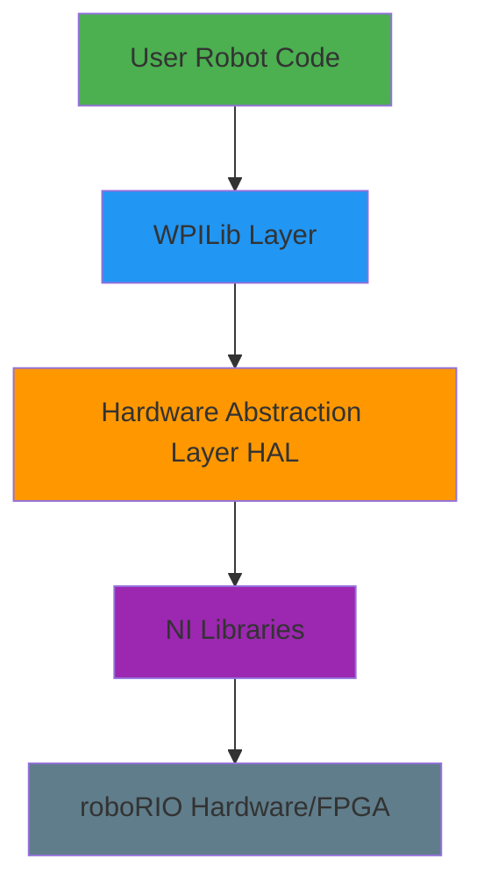
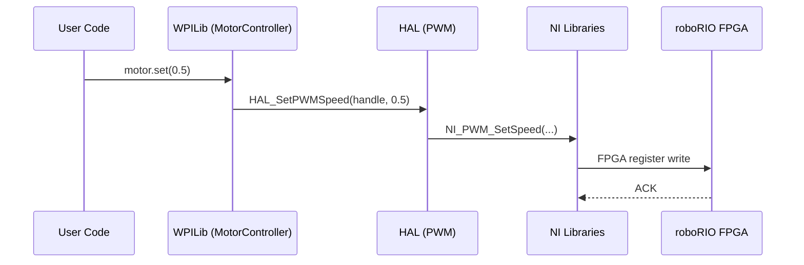

## Overview

WPILib is a comprehensive robotics framework designed to help FIRST Robotics teams write robot code efficiently. The framework follows a layered architecture that abstracts hardware details while providing full control when needed.

<Note>
The WPILib mission is to "raise the floor, don't lower the ceiling" - enabling teams with limited programming knowledge to be successful while not hampering the abilities of advanced teams.
</Note>

## Architecture Layers

WPILib consists of three primary layers, each serving a distinct purpose:



### 1. User Robot Code

This is where teams write their robot-specific logic:
- Subsystem definitions
- Command implementations
- Autonomous routines
- Teleop control schemes

### 2. WPILib Layer

The high-level API that provides:
- **Motor Controllers**: Control various motor types (PWM, CAN-based)
- **Sensors**: Interface with encoders, gyros, accelerometers, vision
- **Pneumatics**: Solenoid and compressor control
- **Driver Station Communication**: Joystick input, robot state
- **Command Framework**: Organize robot behavior into reusable commands
- **Kinematics & Odometry**: Drive train math and position tracking

Available in three language implementations:
- **WPILibJ**: Java implementation (`wpilibj/`)
- **WPILibC**: C++ implementation (`wpilibc/`)
- **WPILibPy**: Python implementation (separate repository)

### 3. Hardware Abstraction Layer (HAL)

The HAL provides a consistent interface to roboRIO hardware:
- Low-level hardware access
- Platform-independent API
- Handle-based resource management
- Simulation support

Located in the `hal/` directory, the HAL abstracts:
- Digital I/O (DIO)
- Analog inputs/outputs
- PWM generation
- Encoders and counters
- CAN bus communication
- SPI and I2C protocols
- Interrupts and notifiers

### 4. NI Libraries

The lowest level contains proprietary National Instruments libraries that:
- Interface directly with roboRIO FPGA
- Provide real-time control capabilities
- Handle low-level device drivers

## Code Organization

The WPILib repository is organized into focused subprojects:

```
allwpilib/
├── hal/                    # Hardware Abstraction Layer
│   ├── src/main/native/athena/    # roboRIO implementation
│   ├── src/main/native/sim/       # Simulator implementation
│   └── src/main/native/include/   # HAL headers
├── wpilibj/                # Java WPILib
│   ├── src/main/java/             # Platform-independent Java
│   └── src/main/native/           # JNI bindings to HAL
├── wpilibc/                # C++ WPILib
│   ├── src/main/native/cpp/shared/  # Platform-independent C++
│   ├── src/main/native/cpp/athena/  # roboRIO-specific code
│   └── src/main/native/cpp/sim/     # Simulator code
├── wpilibNewCommands/      # Command-based framework (v2)
├── wpimath/                # Math utilities (geometry, kinematics, etc.)
├── ntcore/                 # NetworkTables core
├── cscore/                 # Camera server
├── cameraserver/           # High-level camera API
└── wpinet/                 # Networking utilities
```

<Info>
**Platform Support**: Code is divided into `shared`, `athena` (roboRIO), and `sim` (desktop simulation) directories. Shared code must be platform-independent since it compiles for both ARM (roboRIO) and desktop architectures.
</Info>

## Cross-Platform Compilation

WPILib supports multiple deployment targets:

| Target | Architecture | Use Case |
|--------|-------------|----------|
| **Athena** | ARM (roboRIO) | Competition robots |
| **Desktop** | x86/x64 | Simulation, testing |
| **Raspberry Pi** | ARM32 | Coprocessor applications |

The build system (Gradle) handles cross-compilation automatically:
- ARM toolchain for roboRIO deployment
- Native compiler for desktop simulation
- Platform-specific implementations selected at compile time

## Key Design Principles

### Language Parity

WPILib maintains feature parity between Java, C++, and Python so teams can choose based on preference rather than capability limitations.

### Type Safety

The HAL uses strongly-typed handles to prevent resource misuse:

```cpp
typedef HAL_Handle HAL_DigitalHandle;
typedef HAL_Handle HAL_AnalogInputHandle;
typedef HAL_Handle HAL_EncoderHandle;
// Each type prevents accidental cross-use
```

### Resource Management

C++ WPILib uses RAII (Resource Acquisition Is Initialization) patterns:
- Automatic cleanup when objects go out of scope
- Move-only semantics for hardware resources
- Smart handle wrappers in HAL

### Simulation Support

Every layer includes simulation capabilities:
- HAL provides simulated hardware implementations
- Desktop builds allow testing without physical hardware
- Simulation hooks for physics engines and visualizers

## Communication Flow Example

Here's how setting a motor speed flows through the architecture:



## Next Steps

- Learn about the [Hardware Abstraction Layer](/concepts/hardware-abstraction-layer)
- Explore [Command-Based Programming](/concepts/command-based-programming)
- Understand the [Robot Lifecycle](/concepts/robot-lifecycle)
