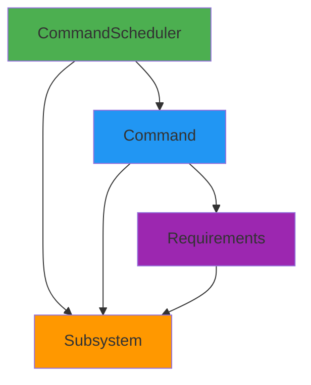
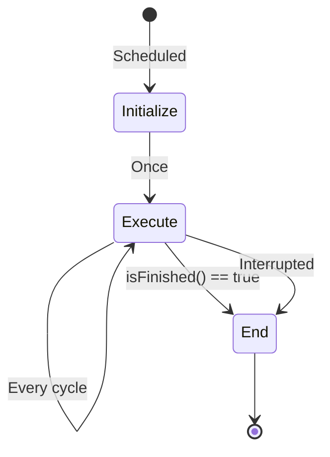

## What is Command-Based Programming?

Command-based programming is a design pattern that structures robot code as a collection of discrete actions (commands) that operate on robot mechanisms (subsystems). This approach promotes code reusability, testability, and maintainability.

<Note>
The command-based framework is provided by the `wpilibNewCommands` library, also known as "Command-Based v2". It represents a modern redesign with improved composition and decorator patterns.
</Note>

## Core Concepts



### The Three Pillars

1. **Commands**: Actions the robot performs
2. **Subsystems**: Robot mechanisms that commands control
3. **CommandScheduler**: Manages command execution and subsystem allocation

## Commands

A command represents a discrete robot action with a defined lifecycle.

### Command Lifecycle

Every command goes through these states:



### Command Methods

From `frc2/command/Command.h`:

```cpp
class Command {
public:
  // Called once when command is scheduled
  virtual void Initialize();
  
  // Called repeatedly while command is running
  virtual void Execute();
  
  // Called once when command ends
  // @param interrupted - true if command was interrupted
  virtual void End(bool interrupted);
  
  // Returns true when command should finish
  virtual bool IsFinished() { return false; }
  
  // Returns the subsystems this command requires
  virtual wpi::SmallSet<Subsystem*, 4> GetRequirements() const;
  
  // Whether command runs when robot is disabled
  virtual bool RunsWhenDisabled() const { return false; }
};
```

### Example Command

**C++ Example**:
```cpp
class DriveForward : public CommandHelper<Command, DriveForward> {
public:
  DriveForward(DriveSubsystem* drive, double distance)
    : m_drive(drive), m_distance(distance) {
    AddRequirements(m_drive);
  }
  
  void Initialize() override {
    m_drive->resetEncoders();
  }
  
  void Execute() override {
    m_drive->arcadeDrive(0.5, 0);
  }
  
  void End(bool interrupted) override {
    m_drive->arcadeDrive(0, 0);
  }
  
  bool IsFinished() override {
    return m_drive->getAverageDistance() >= m_distance;
  }
  
private:
  DriveSubsystem* m_drive;
  double m_distance;
};
```

**Java Example**:
```java
public class DriveForward extends Command {
  private final DriveSubsystem m_drive;
  private final double m_distance;
  
  public DriveForward(DriveSubsystem drive, double distance) {
    m_drive = drive;
    m_distance = distance;
    addRequirements(m_drive);
  }
  
  @Override
  public void initialize() {
    m_drive.resetEncoders();
  }
  
  @Override
  public void execute() {
    m_drive.arcadeDrive(0.5, 0);
  }
  
  @Override
  public void end(boolean interrupted) {
    m_drive.arcadeDrive(0, 0);
  }
  
  @Override
  public boolean isFinished() {
    return m_drive.getAverageDistance() >= m_distance;
  }
}
```

### Inline Commands

For simple commands, use factory methods instead of creating classes:

**C++**:
```cpp
// Instant command
auto shootCommand = cmd::RunOnce([&] { m_shooter.fire(); }, {&m_shooter});

// Continuous command
auto driveCommand = cmd::Run([&] { 
  m_drive.arcadeDrive(controller.GetY(), controller.GetX()); 
}, {&m_drive});

// Command that ends
auto timedCommand = cmd::Run(
  [&] { m_intake.run(); },
  {&m_intake}
).WithTimeout(2_s);
```

**Java**:
```java
// Instant command
Command shootCommand = Commands.runOnce(() -> shooter.fire(), shooter);

// Continuous command  
Command driveCommand = Commands.run(
  () -> drive.arcadeDrive(controller.getY(), controller.getX()),
  drive
);

// Command that ends
Command timedCommand = Commands.run(() -> intake.run(), intake)
  .withTimeout(2.0);
```

## Subsystems

Subsystems represent distinct robot mechanisms (drivetrain, arm, shooter, etc.).

### Subsystem Interface

From `frc2/command/SubsystemBase.h`:

```cpp
class SubsystemBase : public Subsystem {
public:
  // Called periodically by the scheduler
  virtual void Periodic() {}
  
  // Called periodically during simulation
  virtual void SimulationPeriodic() {}
  
  // Get/set subsystem name for telemetry
  std::string GetName() const;
  void SetName(std::string_view name);
  
protected:
  SubsystemBase();
  explicit SubsystemBase(std::string_view name);
};
```

### Example Subsystem

```cpp
class DriveSubsystem : public SubsystemBase {
public:
  DriveSubsystem() {
    SetName("Drive");
  }
  
  // Command-callable methods
  void arcadeDrive(double forward, double rotation) {
    m_drive.ArcadeDrive(forward, rotation);
  }
  
  void resetEncoders() {
    m_leftEncoder.Reset();
    m_rightEncoder.Reset();
  }
  
  double getAverageDistance() {
    return (m_leftEncoder.GetDistance() + m_rightEncoder.GetDistance()) / 2.0;
  }
  
  // Called every scheduler cycle
  void Periodic() override {
    // Update telemetry
    frc::SmartDashboard::PutNumber("Left Distance", m_leftEncoder.GetDistance());
    frc::SmartDashboard::PutNumber("Right Distance", m_rightEncoder.GetDistance());
  }
  
private:
  frc::DifferentialDrive m_drive{m_leftMotor, m_rightMotor};
  frc::PWMSparkMax m_leftMotor{0};
  frc::PWMSparkMax m_rightMotor{1};
  frc::Encoder m_leftEncoder{0, 1};
  frc::Encoder m_rightEncoder{2, 3};
};
```

### Default Commands

Subsystems can have a default command that runs when no other command requires them:

```cpp
// Set in robot initialization
CommandScheduler::GetInstance().SetDefaultCommand(
  &m_drive,
  cmd::Run([&] {
    m_drive.arcadeDrive(m_controller.GetY(), m_controller.GetX());
  }, {&m_drive})
);
```

## CommandScheduler

The singleton scheduler manages command execution.

### Scheduler Responsibilities

From `frc2/command/CommandScheduler.h`, the scheduler:

1. **Runs subsystem periodic methods**
2. **Polls button bindings** for new commands
3. **Executes scheduled commands**
4. **Checks end conditions** and finishes commands
5. **Schedules default commands** for unused subsystems

### Scheduler API

```cpp
class CommandScheduler {
public:
  // Get singleton instance
  static CommandScheduler& GetInstance();
  
  // Schedule a command
  void Schedule(Command* command);
  void Schedule(CommandPtr&& command);
  
  // Cancel commands
  void Cancel(Command* command);
  void CancelAll();
  
  // Run one iteration (call from robotPeriodic)
  void Run();
  
  // Register subsystems
  void RegisterSubsystem(Subsystem* subsystem);
  
  // Set default command for subsystem
  template <std::derived_from<Command> T>
  void SetDefaultCommand(Subsystem* subsystem, T&& command);
};
```

### Integration with Robot Code

```cpp
class Robot : public frc::TimedRobot {
public:
  void RobotPeriodic() override {
    // Run scheduler every cycle
    frc2::CommandScheduler::GetInstance().Run();
  }
  
  void AutonomousInit() override {
    // Schedule autonomous command
    CommandScheduler::GetInstance().Schedule(m_autonomousCommand.get());
  }
  
  void TeleopInit() override {
    // Cancel autonomous
    CommandScheduler::GetInstance().CancelAll();
  }
};
```

## Requirements and Interruption

### How Requirements Work

1. Commands declare which subsystems they need
2. Only one command can require a subsystem at a time
3. When conflicts occur, interruption behavior determines outcome

```cpp
class MyCommand : public CommandHelper<Command, MyCommand> {
public:
  MyCommand(Subsystem* subsystem) {
    AddRequirements(subsystem);  // Declare requirement
  }
};
```

### Interruption Behavior

From `frc2/command/Command.h`:

```cpp
enum class InterruptionBehavior {
  kCancelSelf,      // Default: this command ends, new command runs
  kCancelIncoming   // This command continues, new command doesn't run
};

virtual InterruptionBehavior GetInterruptionBehavior() const {
  return InterruptionBehavior::kCancelSelf;
}
```

## Command Composition

Commands can be combined using decorators and groups.

### Sequential Commands

Run commands one after another:

```cpp
auto sequence = cmd::Sequence(
  DriveForward(&m_drive, 1.0),
  TurnToAngle(&m_drive, 90_deg),
  DriveForward(&m_drive, 0.5)
);
```

### Parallel Commands

**Parallel** (ends when all finish):
```cpp
auto parallel = cmd::Parallel(
  RaiseArm(&m_arm),
  OpenGripper(&m_gripper)
);
```

**Race** (ends when first finishes):
```cpp
auto race = cmd::Race(
  DriveForward(&m_drive, 10.0),
  cmd::Wait(5_s)  // Safety timeout
);
```

**Deadline** (ends when deadline finishes):
```cpp
auto deadline = cmd::Deadline(
  cmd::Wait(3_s),              // Deadline command
  KeepArmUp(&m_arm),           // Parallel commands
  RunIntake(&m_intake)
);
```

### Decorators

Commands support fluent decorator methods:

```cpp
auto command = DriveForward(&m_drive, 2.0)
  .WithTimeout(3_s)                    // Add timeout
  .AndThen([&] { m_drive.stop(); })   // Run after
  .OnlyWhile([&] { return m_sensor.get(); })  // Conditional
  .WithName("Drive Forward Sequence"); // Set name
```

## Triggers and Button Bindings

Triggers automatically schedule commands based on conditions:

```cpp
// Button triggers
m_controller.A().OnTrue(cmd::RunOnce([&] { m_shooter.fire(); }, {&m_shooter}));
m_controller.B().WhileTrue(cmd::Run([&] { m_intake.run(); }, {&m_intake}));
m_controller.X().OnFalse(cmd::RunOnce([&] { m_climber.retract(); }, {&m_climber}));

// Custom triggers
frc2::Trigger([&] { return m_vision.hasTarget(); })
  .OnTrue(AutoAlign(&m_drive, &m_vision));
```

## Best Practices

<Info>
1. **One subsystem per mechanism** - Keep subsystems focused
2. **Commands should be reusable** - Parameterize behavior
3. **Use requirements correctly** - Declare all subsystems used
4. **Default commands for driver control** - Always have manual control
5. **Test commands independently** - Unit test command logic
6. **Use inline commands for simple actions** - Avoid class bloat
7. **Compose complex behaviors** - Combine simple commands
</Info>

## Next Steps

- Learn about [WPILib Architecture](/concepts/architecture)
- Understand the [Hardware Abstraction Layer](/concepts/hardware-abstraction-layer)
- Explore the [Robot Lifecycle](/concepts/robot-lifecycle)
