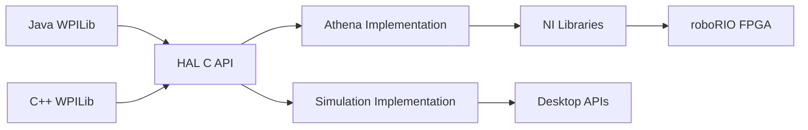

## What is the HAL?

The Hardware Abstraction Layer (HAL) is the foundation of WPILib that provides a consistent, platform-independent interface to roboRIO hardware. It sits between the high-level WPILib APIs and the low-level NI Libraries that control the FPGA.

<Note>
The HAL is written in C to provide maximum portability and performance. WPILib's Java and C++ libraries both use the HAL through JNI (Java Native Interface) and direct C++ calls respectively.
</Note>

## HAL Architecture



## Core HAL Components

The HAL is organized into functional modules, each responsible for specific hardware:

### Digital I/O (DIO)

Provides access to digital input/output pins on the roboRIO.

**Key Functions** (`hal/DIO.h`):
```cpp
HAL_DigitalHandle HAL_InitializeDIOPort(
    HAL_PortHandle portHandle,
    HAL_Bool input,
    const char* allocationLocation,
    int32_t* status
);

void HAL_SetDIO(HAL_DigitalHandle handle, HAL_Bool value, int32_t* status);
HAL_Bool HAL_GetDIO(HAL_DigitalHandle handle, int32_t* status);
void HAL_SetDIODirection(HAL_DigitalHandle handle, HAL_Bool input, int32_t* status);
void HAL_FreeDIOPort(HAL_DigitalHandle handle);
```

**Features**:
- Configurable input/output direction
- Digital pulse generation
- Filter for debouncing signals
- Channel validation

### Analog Input/Output

**Modules**:
- `hal/AnalogInput.h` - Read analog voltages (0-5V)
- `hal/AnalogOutput.h` - Generate analog output voltages
- `hal/AnalogAccumulator.h` - Hardware-based integration
- `hal/AnalogGyro.h` - Analog gyroscope support
- `hal/AnalogTrigger.h` - Trigger on analog thresholds

### PWM (Pulse Width Modulation)

Controls motor controllers, servos, and other PWM devices.

**Module**: `hal/PWM.h`

**Features**:
- Configurable PWM period and pulse width
- Multiple PWM generators
- Automatic safety timeout
- Raw and scaled value setting

### Encoders

Interface with quadrature encoders for position/velocity feedback.

**Module**: `hal/Encoder.h`

**Features**:
- Quadrature decoding (1x, 2x, 4x)
- Direction sensing
- Period measurement for velocity
- Counter reset and reversal

### Communication Protocols

#### CAN Bus
- **Module**: `hal/CAN.h`, `hal/CANAPI.h`
- Control CAN-based motor controllers and sensors
- Hardware message filtering
- Periodic transmission

#### SPI (Serial Peripheral Interface)
- **Module**: `hal/SPI.h`, `hal/SPITypes.h`
- Communicate with SPI devices (gyros, accelerometers)
- Auto-transaction support
- Configurable clock rate and data modes

#### I2C (Inter-Integrated Circuit)
- **Module**: `hal/I2C.h`, `hal/I2CTypes.h`
- Interface with I2C sensors
- Read/write transactions
- Address-based device selection

### Interrupts and Timing

#### Notifier
**Module**: `hal/Notifier.h`

Provides precise periodic callbacks:
```cpp
HAL_NotifierHandle HAL_InitializeNotifier(int32_t* status);
void HAL_UpdateNotifierAlarm(HAL_NotifierHandle handle, uint64_t triggerTime, int32_t* status);
uint64_t HAL_WaitForNotifierAlarm(HAL_NotifierHandle handle, int32_t* status);
void HAL_CleanNotifier(HAL_NotifierHandle handle);
```

Used by `TimedRobot` for periodic execution.

#### Interrupts
**Module**: `hal/Interrupts.h`

Hardware interrupts for asynchronous event handling:
- Rising/falling edge detection
- Synchronous and asynchronous interrupts
- Timestamping

### Driver Station Communication

**Module**: `hal/DriverStation.h`, `hal/DriverStationTypes.h`

Handles communication with the FRC Driver Station:
- Robot mode (disabled, autonomous, teleop, test)
- Joystick data
- Alliance station information
- Match time
- Emergency stop

### Pneumatics

**Modules**:
- `hal/CTREPCM.h` - CTRE Pneumatics Control Module
- `hal/REVPH.h` - REV Pneumatics Hub

Control pneumatic solenoids and compressors.

### Power Management

**Modules**:
- `hal/Power.h` - Battery voltage, current monitoring
- `hal/PowerDistribution.h` - PDP/PDH interface

## Handle-Based Resource Management

The HAL uses opaque handles to represent hardware resources:

```cpp
typedef int32_t HAL_Handle;

// Type-safe handles for different resources
typedef HAL_Handle HAL_DigitalHandle;
typedef HAL_Handle HAL_AnalogInputHandle;
typedef HAL_Handle HAL_EncoderHandle;
typedef HAL_Handle HAL_NotifierHandle;
// ... and many more
```

### Benefits

1. **Type Safety**: Prevents using wrong handle types
2. **Resource Tracking**: Internal reference counting
3. **Cleanup**: Explicit free functions prevent leaks
4. **Abstraction**: Implementation details hidden from users

### C++ Handle Wrapper

C++ code uses a smart handle wrapper for automatic cleanup:

```cpp
namespace hal {
template <typename CType, 
          void (*FreeFunction)(CType) = nullptr,
          int32_t CInvalid = HAL_kInvalidHandle>
class Handle {
 public:
  Handle() = default;
  Handle(CType val) : m_handle(val) {}
  
  // Move-only semantics
  Handle(const Handle&) = delete;
  Handle(Handle&& rhs) : m_handle(rhs.m_handle) {
    rhs.m_handle = CInvalid;
  }
  
  // Automatic cleanup
  ~Handle() {
    if constexpr (FreeFunction != nullptr) {
      if (m_handle != CInvalid) {
        FreeFunction(m_handle);
      }
    }
  }
  
  operator CType() const { return m_handle; }
  
 private:
  CType m_handle = CInvalid;
};
}
```

**Example Usage**:
```cpp
hal::Handle<HAL_NotifierHandle, HAL_CleanNotifier> m_notifier;
m_notifier = HAL_InitializeNotifier(&status);
// Automatically cleaned up when m_notifier goes out of scope
```

## Error Handling

Most HAL functions accept a status pointer:

```cpp
int32_t status = 0;
HAL_DigitalHandle handle = HAL_InitializeDIOPort(portHandle, true, "myDIO", &status);
if (status != 0) {
    // Handle error
}
```

**Common Status Codes** (`hal/Errors.h`):
- `0`: Success
- Non-zero: Error code indicating specific failure

## Simulation Support

The HAL provides separate implementations for robot and simulation:

### Directory Structure
```
hal/src/main/native/
├── athena/          # Real roboRIO implementation
├── sim/             # Desktop simulation implementation
└── include/         # Common headers
```

### Simulation Data API

**Module**: `hal/simulation/` (various `*Data.h` files)

Provides simulation hooks:
- `hal/simulation/DIOData.h` - Digital I/O simulation
- `hal/simulation/EncoderData.h` - Encoder simulation
- `hal/simulation/PWMData.h` - PWM output simulation
- `hal/simulation/DriverStationData.h` - Driver station simulation

These allow physics engines and simulators to:
- Read output values (PWM, digital outputs)
- Set input values (encoders, digital inputs, sensors)
- Register callbacks for value changes

## HAL Initialization

**Module**: `hal/HAL.h`, `hal/HALBase.h`

Every robot program must initialize the HAL:

```cpp
#include "hal/HAL.h"

int main() {
    HAL_Initialize(500, 0);  // Initialize with timeout
    // ... robot code
    HAL_Shutdown();
}
```

WPILib's `RobotBase` handles this automatically.

## Usage Reporting

**Module**: `hal/FRCUsageReporting.h`

Tracks usage statistics:
- Which WPILib features are used
- Resource allocation counts
- Helps WPILib team prioritize development

```cpp
HAL_Report(HAL_tResourceType::kResourceType_Framework, 
           HAL_tInstances::kFramework_Timed);
```

## Key Takeaways

<Info>
- The HAL provides a **C-based API** for all roboRIO hardware
- Uses **opaque handles** for type-safe resource management
- Supports both **real hardware** and **simulation**
- All errors reported via **status codes**
- Automatically handles **resource cleanup** in C++ via smart handles
</Info>

## Next Steps

- Explore [WPILib Architecture](/concepts/architecture) for the bigger picture
- Learn [Command-Based Programming](/concepts/command-based-programming)
- Understand the [Robot Lifecycle](/concepts/robot-lifecycle)
