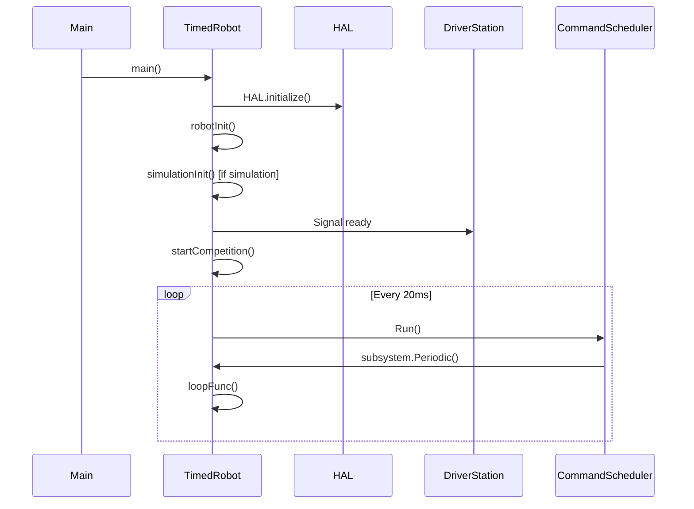
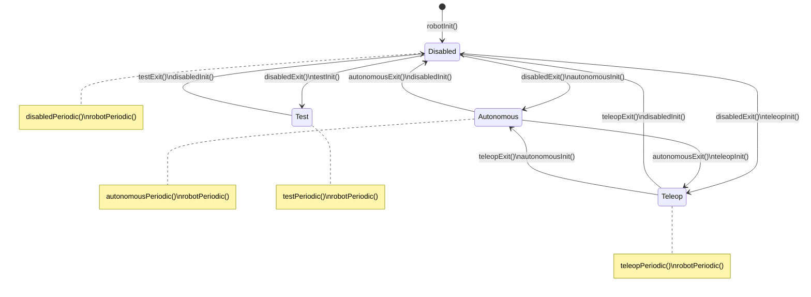
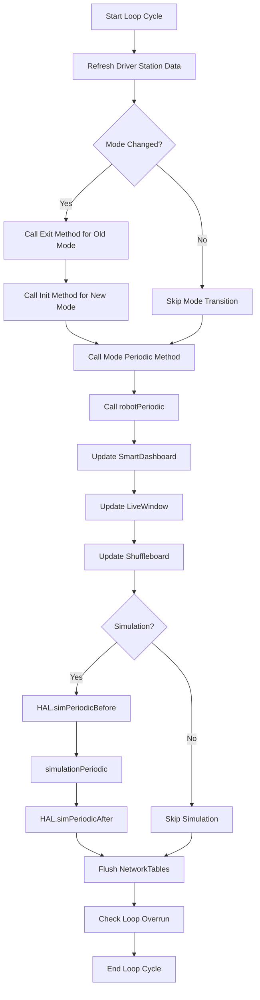

## Overview

WPILib robot programs follow a structured lifecycle with specific methods called at different stages of robot operation. Understanding this lifecycle is crucial for proper initialization, periodic updates, and mode transitions.

## Robot Base Classes

WPILib provides several base classes for robot programs:

| Class | Description | Use Case |
|-------|-------------|----------|
| `TimedRobot` | Periodic callback-based robot | Most common, recommended for teams |
| `IterativeRobot` | Legacy iterative robot (deprecated) | Older codebases |
| `RobotBase` | Abstract base class | Custom implementations |

<Note>
**TimedRobot** is the recommended base class. It provides precise timing using hardware notifiers and is used in 95%+ of FRC robot programs.
</Note>

## TimedRobot Lifecycle

### Program Startup



### Lifecycle Methods

From `wpilibj/src/main/java/edu/wpi/first/wpilibj/IterativeRobotBase.java` and `TimedRobot.java`:

## Initialization Methods

### robotInit()

Called once when the robot is first powered on.

```java
public void robotInit() {
  // Initialize subsystems
  // Configure autonomous chooser
  // Set up dashboard
  // Initialize camera server
}
```

**Use for**:
- Creating subsystem instances
- Configuring sensors and actuators
- Setting up autonomous selection
- Initializing NetworkTables
- Starting camera feeds

<Info>
In C++, prefer using the class constructor over `robotInit()` for initialization.
</Info>

### simulationInit()

Called once after `robotInit()`, only when running in simulation.

```java
public void simulationInit() {
  // Initialize physics simulation
  // Set up simulated sensors
}
```

### driverStationConnected()

Called once when the Driver Station first connects.

```java
public void driverStationConnected() {
  // Get alliance station
  // Read game-specific data
}
```

**Use for**:
- Reading alliance color
- Getting field configuration
- Match-specific initialization

## Mode Init Methods

Called once each time the robot enters a specific mode.

### disabledInit()

```java
public void disabledInit() {
  // Stop all motors
  // Reset state machines
}
```

### autonomousInit()

```java
public void autonomousInit() {
  // Schedule autonomous command
  // Reset odometry
  // Get autonomous selection
}
```

### teleopInit()

```java
public void teleopInit() {
  // Cancel autonomous commands
  // Enable driver control
}
```

### testInit()

```java
public void testInit() {
  // Enable LiveWindow (optional)
  // Start test routines
}
```

## Periodic Methods

Called repeatedly (default: every 20ms) while in the corresponding mode.

### robotPeriodic()

Called in **all modes** (disabled, autonomous, teleop, test).

```java
public void robotPeriodic() {
  // Run command scheduler (REQUIRED for command-based)
  CommandScheduler.getInstance().run();
  
  // Update telemetry
  SmartDashboard.putNumber("Battery Voltage", RobotController.getBatteryVoltage());
  
  // Update vision processing
  // Log data
}
```

<Note>
**Command-based programs MUST call `CommandScheduler.getInstance().run()` in `robotPeriodic()`**. This is the only required code for command-based programming.
</Note>

### disabledPeriodic()

```java
public void disabledPeriodic() {
  // Update autonomous selection
  // Monitor robot state
}
```

### autonomousPeriodic()

```java
public void autonomousPeriodic() {
  // Command scheduler handles execution
  // Manual autonomous code (if not using commands)
}
```

### teleopPeriodic()

```java
public void teleopPeriodic() {
  // Command scheduler handles execution
  // Manual teleop code (if not using commands)
}
```

### testPeriodic()

```java
public void testPeriodic() {
  // Test-specific code
}
```

### simulationPeriodic()

Called after all other periodic methods during simulation.

```java
public void simulationPeriodic() {
  // Update physics simulation
  // Simulate sensor inputs
}
```

## Exit Methods

Called once when exiting a mode.

### disabledExit()

```java
public void disabledExit() {
  // Prepare for enabled mode
}
```

### autonomousExit()

```java
public void autonomousExit() {
  // Clean up autonomous resources
}
```

### teleopExit()

```java
public void teleopExit() {
  // Stop driver control
}
```

### testExit()

```java
public void testExit() {
  // Disable LiveWindow
  // Clean up test resources
}
```

## Mode Transition Flow



## Execution Order Within Each Cycle

From `IterativeRobotBase.loopFunc()` (line 301-428):



### Execution Details

**Order of execution** in each 20ms loop:

1. Refresh Driver Station data
2. Check for mode changes
   - If mode changed: call old mode's `exit()`, then new mode's `init()`
3. Call current mode's `periodic()` method:
   - `disabledPeriodic()` / `autonomousPeriodic()` / `teleopPeriodic()` / `testPeriodic()`
4. Call `robotPeriodic()` (in ALL modes)
5. Update SmartDashboard values
6. Update LiveWindow values (if enabled)
7. Update Shuffleboard
8. If simulation:
   - Call `HAL.simPeriodicBefore()`
   - Call `simulationPeriodic()`
   - Call `HAL.simPeriodicAfter()`
9. Flush NetworkTables
10. Check for loop overruns (prints warning if >20ms)

## TimedRobot Implementation Details

### Precise Timing with Notifiers

From `frc/TimedRobot.h` and `TimedRobot.java`:

```cpp
class TimedRobot : public IterativeRobotBase {
public:
  static constexpr auto kDefaultPeriod = 20_ms;
  
  explicit TimedRobot(units::second_t period = kDefaultPeriod);
  
  // Add custom periodic callbacks
  void AddPeriodic(std::function<void()> callback, 
                   units::second_t period,
                   units::second_t offset = 0_s);
  
private:
  hal::Handle<HAL_NotifierHandle, HAL_CleanNotifier> m_notifier;
  std::chrono::microseconds m_startTime;
  wpi::priority_queue<Callback> m_callbacks;
};
```

### Custom Periodic Callbacks

Add additional periodic functions at different rates:

**C++**:
```cpp
class Robot : public frc::TimedRobot {
public:
  Robot() {
    // Default 20ms period
    AddPeriodic([&] { FastUpdate(); }, 10_ms);
    
    // Slower update with offset
    AddPeriodic([&] { SlowUpdate(); }, 100_ms, 5_ms);
  }
  
private:
  void FastUpdate() {
    // Called every 10ms
  }
  
  void SlowUpdate() {
    // Called every 100ms, offset by 5ms
  }
};
```

**Java**:
```java
public class Robot extends TimedRobot {
  public Robot() {
    super();
    // Default 0.02s period
    addPeriodic(this::fastUpdate, 0.01);  // 10ms
    addPeriodic(this::slowUpdate, 0.1, 0.005);  // 100ms, 5ms offset
  }
  
  private void fastUpdate() {
    // Called every 10ms
  }
  
  private void slowUpdate() {
    // Called every 100ms, offset by 5ms
  }
}
```

### Loop Overrun Detection

TimedRobot monitors loop execution time:

```java
public double getPeriod() {
  return m_period;  // Returns configured period (default 0.02s)
}

public void printWatchdogEpochs() {
  m_watchdog.printEpochs();  // Shows timing of each epoch
}
```

If a loop takes longer than the period, a warning is printed:
```text
Warning at edu.wpi.first.wpilibj.IterativeRobotBase.printLoopOverrunMessage(IterativeRobotBase.java:436): Loop time of 0.02s overrun
```

## Complete Example

**Command-Based Robot** (C++):

```cpp
class Robot : public frc::TimedRobot {
public:
  void RobotInit() override {
    // Create subsystems
    m_drive = new DriveSubsystem();
    m_shooter = new ShooterSubsystem();
    
    // Configure button bindings
    ConfigureButtonBindings();
    
    // Set up autonomous chooser
    m_chooser.SetDefaultOption("Simple Auto", &m_simpleAuto);
    m_chooser.AddOption("Complex Auto", &m_complexAuto);
    frc::SmartDashboard::PutData("Auto Mode", &m_chooser);
  }
  
  void RobotPeriodic() override {
    // REQUIRED: Run command scheduler
    frc2::CommandScheduler::GetInstance().Run();
  }
  
  void AutonomousInit() override {
    // Get selected autonomous command
    m_autonomousCommand = m_chooser.GetSelected();
    
    if (m_autonomousCommand != nullptr) {
      m_autonomousCommand->Schedule();
    }
  }
  
  void AutonomousExit() override {
    // Autonomous command will be auto-cancelled
  }
  
  void TeleopInit() override {
    // Cancel autonomous command
    if (m_autonomousCommand != nullptr) {
      m_autonomousCommand->Cancel();
    }
  }
  
  void DisabledInit() override {
    // Stop all commands
    frc2::CommandScheduler::GetInstance().CancelAll();
  }
  
  void SimulationPeriodic() override {
    // Update physics simulation
    m_driveSimulation.Update();
  }
  
private:
  DriveSubsystem* m_drive;
  ShooterSubsystem* m_shooter;
  frc::SendableChooser<frc2::Command*> m_chooser;
  frc2::Command* m_autonomousCommand;
};

#ifndef RUNNING_FRC_TESTS
int main() {
  return frc::StartRobot<Robot>();
}
#endif
```

## Key Takeaways

<Info>
1. **robotInit()** runs once at startup
2. **robotPeriodic()** runs every cycle in ALL modes
3. **Mode init methods** run once when entering a mode
4. **Mode periodic methods** run every cycle in that mode
5. **Mode exit methods** run once when leaving a mode
6. **Command-based programs MUST call CommandScheduler.run() in robotPeriodic()**
7. **Default period is 20ms** (50Hz)
8. **Loop overruns** are detected and reported automatically
</Info>

## Next Steps

- Learn about [WPILib Architecture](/concepts/architecture)
- Explore [Command-Based Programming](/concepts/command-based-programming)
- Understand the [Hardware Abstraction Layer](/concepts/hardware-abstraction-layer)
